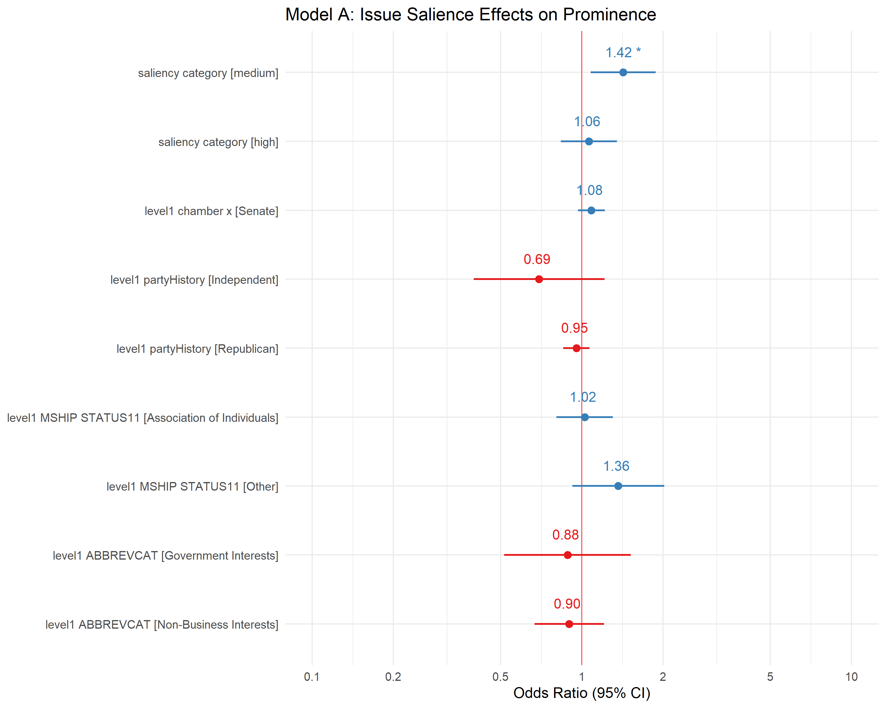
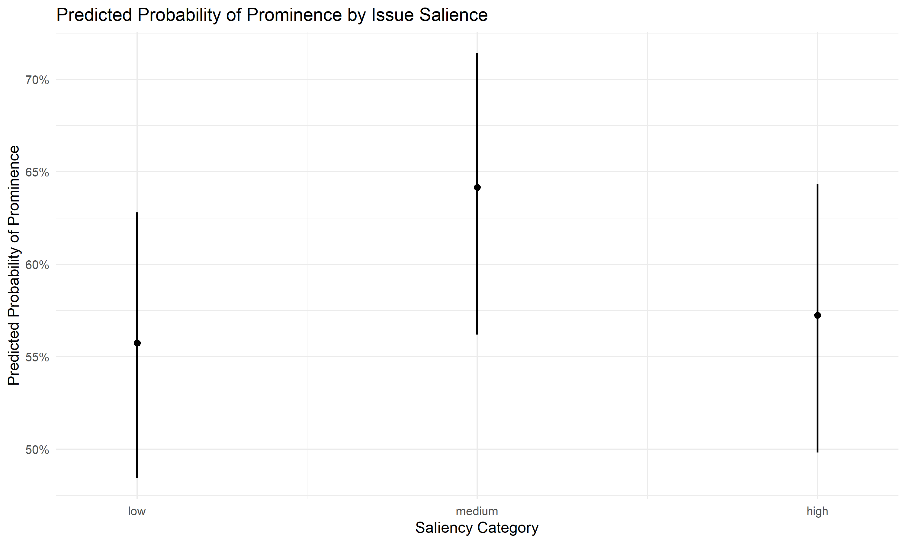
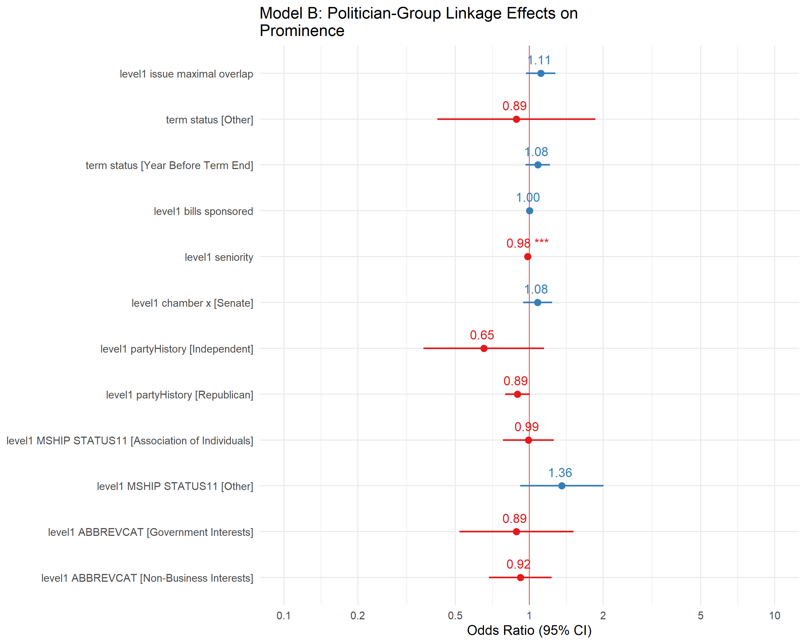
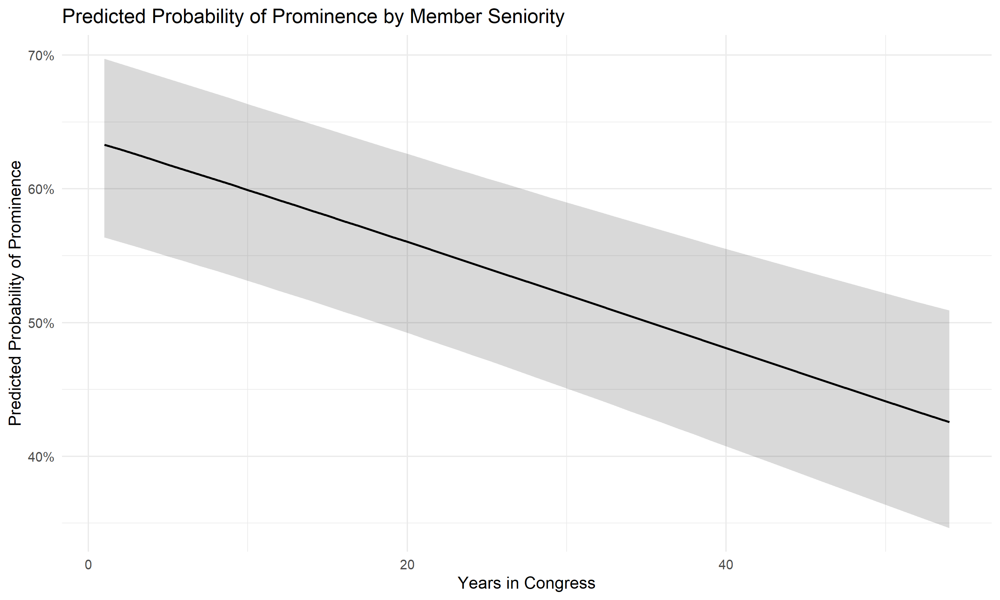
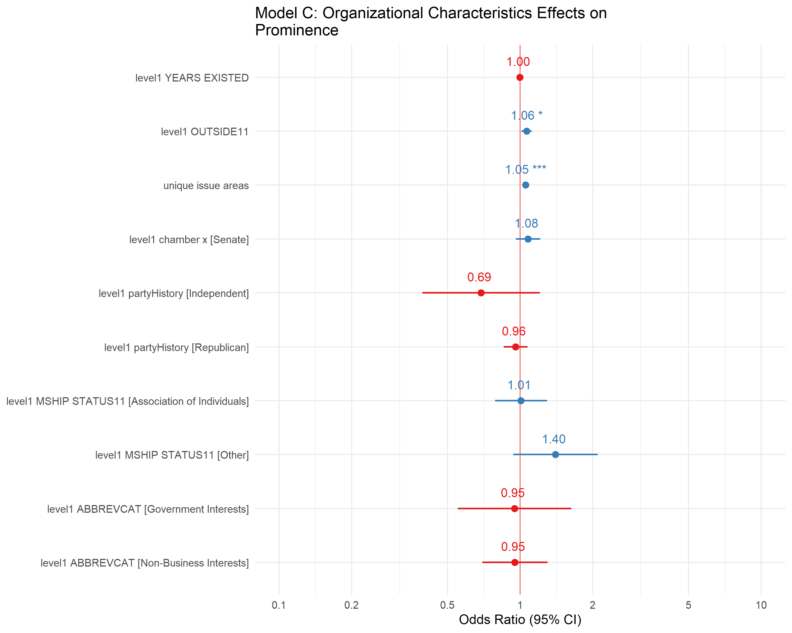
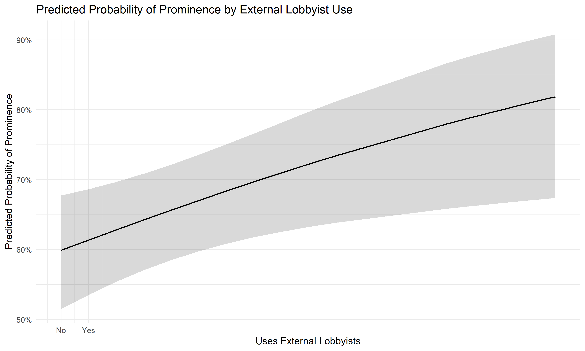
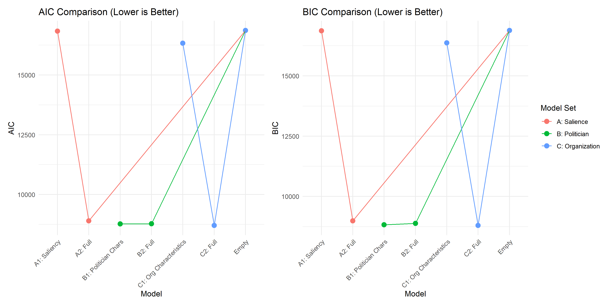

Whose Voice Counts? Understanding Advocacy Group Prominence in
Congressional Discourse
================
Kaleb Mazurek
March 09, 2026

- [Overview](#overview)
- [Setup and Data Loading](#setup-and-data-loading)
  - [Load and Preprocess Data](#load-and-preprocess-data)
  - [Data Overview](#data-overview)
- [Model A: Public Salience and Strategic Voice
  Amplification](#model-a-public-salience-and-strategic-voice-amplification)
  - [The Strategic Communication
    Hypothesis](#the-strategic-communication-hypothesis)
    - [Research Question](#research-question)
    - [Theoretical Expectations](#theoretical-expectations)
    - [Why This Matters for Democratic
      Representation](#why-this-matters-for-democratic-representation)
    - [Measurement](#measurement)
  - [Model A: Empty Model](#model-a-empty-model)
  - [Model A1: Saliency Category Only](#model-a1-saliency-category-only)
  - [Model A2: Full Model with
    Controls](#model-a2-full-model-with-controls)
  - [Model A: Comparison](#model-a-comparison)
  - [Visualization: Model A Results](#visualization-model-a-results)
  - [Policy Implications: Model A
    Findings](#policy-implications-model-a-findings)
    - [Key Findings](#key-findings)
    - [What This Means for Democratic
      Representation](#what-this-means-for-democratic-representation)
    - [Implications for Committee
      Specialization](#implications-for-committee-specialization)
- [Model B: Legislative Signaling and Electoral
  Positioning](#model-b-legislative-signaling-and-electoral-positioning)
  - [The Politician-Group Linkage
    Hypothesis](#the-politician-group-linkage-hypothesis)
    - [Research Question](#research-question-1)
    - [Theoretical Expectations](#theoretical-expectations-1)
    - [Why This Matters for
      Representation](#why-this-matters-for-representation)
    - [Measurement](#measurement-1)
  - [Model B: Empty Model](#model-b-empty-model)
  - [Model B1: Politician
    Characteristics](#model-b1-politician-characteristics)
  - [Model B2: Full Model with
    Controls](#model-b2-full-model-with-controls)
  - [Model B: Comparison](#model-b-comparison)
  - [Visualization: Model B Results](#visualization-model-b-results)
  - [Policy Implications: Model B
    Findings](#policy-implications-model-b-findings)
    - [Key Findings](#key-findings-1)
    - [What This Means for Democratic
      Representation](#what-this-means-for-democratic-representation-1)
    - [Implications for Understanding Legislative
      Communication](#implications-for-understanding-legislative-communication)
- [Model C: Organizational Resources and the Pluralist
  Question](#model-c-organizational-resources-and-the-pluralist-question)
  - [The Resource Mobilization
    Hypothesis](#the-resource-mobilization-hypothesis)
    - [Research Question](#research-question-2)
    - [Theoretical Expectations](#theoretical-expectations-2)
    - [Why This Matters for Pluralism and Democratic
      Voice](#why-this-matters-for-pluralism-and-democratic-voice)
    - [Measurement](#measurement-2)
    - [The Democratic Stakes](#the-democratic-stakes)
  - [Model C: Empty Model](#model-c-empty-model)
  - [Model C1: Organizational
    Characteristics](#model-c1-organizational-characteristics)
  - [Model C2: Full Model with
    Controls](#model-c2-full-model-with-controls)
  - [Model C: Comparison](#model-c-comparison)
  - [Visualization: Model C Results](#visualization-model-c-results)
  - [Policy Implications: Model C
    Findings](#policy-implications-model-c-findings)
    - [Key Findings](#key-findings-2)
    - [What This Means for Democratic
      Pluralism](#what-this-means-for-democratic-pluralism)
    - [Pluralist Theory Implications](#pluralist-theory-implications)
    - [Representation Gaps to Explore](#representation-gaps-to-explore)
- [Overall Results Summary](#overall-results-summary)
  - [Cross-Model Comparison](#cross-model-comparison)
  - [Visualization: Model Fit
    Comparison](#visualization-model-fit-comparison)
- [Discussion](#discussion)
  - [Limitations](#limitations)
- [Appendix: Technical Notes](#appendix-technical-notes)
  - [Session Information](#session-information)
  - [Model Diagnostics](#model-diagnostics)
  - [Export Results](#export-results)
- [References](#references)

------------------------------------------------------------------------

# Overview

This R Markdown document implements the primary inferential models from
my thesis on interest group prominence in congressional floor speeches.
Three sets of generalized linear mixed-effects models (GLMMs) test what
predicts whether an interest group mention is prominent (cited as
authoritative) versus routine.

**Models:**

- **Model A**: Issue salience (does policy salience predict prominence?)
- **Model B**: Politician characteristics (seniority, party, chamber,
  legislative activity)
- **Model C**: Organizational resources (age, lobbying expenditure,
  policy scope)

Random effects: Organization ID and Policy Area (crossed).

Data: 19,165 mentions of 500+ advocacy organizations in the 114th-115th
Congress. Prominence classified by SVM at ~81% accuracy.

**Key findings:**

1.  Medium-salience policy areas predict prominence better than
    high-salience areas
2.  Senior legislators are less likely to cite groups prominently
3.  External lobbyists modestly increase prominence, but the effect is
    not large

For the full thesis manuscript, see
`../legacy/5. Visualization and Reporting/Thesis_UvA_Kaleb_Mazurek.pdf`.

------------------------------------------------------------------------

# Setup and Data Loading

``` r
# Core data manipulation
library(tidyverse)
library(haven)

# Statistical modeling
library(lme4)        # Mixed-effects models
library(lmerTest)    # p-values for mixed models
library(broom.mixed) # Tidy model outputs

# Model comparison and diagnostics
library(performance)
library(see)
library(car)

# Visualization
library(ggplot2)
library(ggeffects)
library(sjPlot)
library(patchwork)

# Tables
library(knitr)
library(kableExtra)
library(gt)

# Set theme
theme_set(theme_minimal(base_size = 12))

# Display options
options(
  digits = 4,
  scipen = 999,
  knitr.kable.NA = ''
)
```

``` r
# Configuration
CONFIG <- list(
  # File paths (relative to analysis/ directory)
  DATA_DIR = file.path("..", "data", "multi_level_data"),
  OUTPUT_DIR = file.path("..", "output", "figures"),

  # Data file
  LEVEL1_FILE = "level1_FINAL.csv",

  # Organization to exclude (if applicable)
  EXCLUDED_ORG_ID = NULL,

  # Random seed
  SEED = 42,

  # Reference categories for modeling
  REF_CHAMBER = "House of Representatives",
  REF_PARTY = "Democrat",
  REF_SALIENCY = "low",
  REF_ORGTYPE = "Business Interests",
  REF_MSHIP = "Association of Institutions",
  REF_TERM = "First Year"
)

# Create output directory
dir.create(CONFIG$OUTPUT_DIR, showWarnings = FALSE, recursive = TRUE)

# Set seed for reproducibility
set.seed(CONFIG$SEED)
```

``` r
#' Load and perform initial filtering of level1 dataset
#'
#' @param filepath Path to CSV file
#' @param excluded_org_id Organization ID to exclude (optional)
#' @return Filtered dataframe
load_data <- function(filepath, excluded_org_id = NULL) {
  # Only read columns used by the models to reduce memory (~175 cols -> ~15)
  needed_cols <- c(
    "level1_prominence", "level1_org_id", "level1_issue_area",
    "level1_chamber_x", "level1_partyHistory", "level1_ABBREVCAT",
    "level1_MSHIP_STATUS11", "level1_seniority", "level1_bills_sponsored",
    "level1_issue_maximal_overlap", "level1_YEARS_EXISTED", "level1_OUTSIDE11",
    "level1_congress",
    # Source columns for derived variables (term_status, saliency_category)
    "level1_year_week", "level1_termBeginYear", "level1_termEndYear",
    "level1_issue_area_salience"
  )
  df <- read_csv(filepath, col_select = all_of(needed_cols), show_col_types = FALSE)

  if (!is.null(excluded_org_id)) {
    df <- df %>% filter(level1_org_id != excluded_org_id)
  }

  message(sprintf("Loaded %s rows, %d columns", format(nrow(df), big.mark = ","), ncol(df)))
  return(df)
}

#' Recode organization category variable
#'
#' Collapses detailed categories into broader groupings:
#' - Business Interests
#' - Government Interests
#' - Non-Business Interests
recode_abbrevcat <- function(df) {
  # Original to readable name mapping
  name_mapping <- c(
    "(1) Corporations" = "Corporations",
    "(13) Social welfare or poor" = "Social Welfare or Poor",
    "(14) State and local governments" = "State and Local Governments",
    "(16) Other" = "Other",
    "(2) Trade and other business associations" = "Trade and Business Associations",
    "(3) Occupational associations" = "Occupational Associations",
    "(4) Unions" = "Unions",
    "(5) Education" = "Education",
    "(6) Health" = "Health",
    "(7) Public interest" = "Public Interest",
    "(8) Identity groups" = "Identity Groups"
  )

  df <- df %>%
    mutate(
      level1_ABBREVCAT = name_mapping[level1_ABBREVCAT],
      # Remove Corporations
      level1_ABBREVCAT = if_else(level1_ABBREVCAT == "Corporations", NA_character_, level1_ABBREVCAT)
    ) %>%
    filter(!is.na(level1_ABBREVCAT)) %>%
    mutate(
      # Collapse into broader categories
      level1_ABBREVCAT = case_when(
        level1_ABBREVCAT %in% c("Trade and Business Associations", "Corporations") ~ "Business-Oriented Interests",
        level1_ABBREVCAT == "State and Local Governments" ~ "Government Interests",
        TRUE ~ "Non-business/nongovernment"
      ),
      # Final collapse
      level1_ABBREVCAT = case_when(
        level1_ABBREVCAT == "Business-Oriented Interests" ~ "Business Interests",
        level1_ABBREVCAT == "Government Interests" ~ "Government Interests",
        TRUE ~ "Non-Business Interests"
      ),
      # Binary indicator
      business_interest = as.integer(level1_ABBREVCAT == "Business Interests")
    )

  message("ABBREVCAT distribution:")
  print(table(df$level1_ABBREVCAT))

  return(df)
}

#' Recode membership status variable
#'
#' Collapses categories into:
#' - Association of Individuals
#' - Association of Institutions
#' - Other
recode_membership_status <- function(df) {
  name_mapping <- c(
    "(1) Institution" = "Institution",
    "(2) Association of individuals" = "Association of Individuals",
    "(3) Association of institutions" = "Association of Institutions",
    "(4) Government or association of governments" = "Government or Association of Governments",
    "(5) Mixed" = "Mixed",
    "(6) Other" = "Other",
    "(9) Cant tell or DK" = "Can't Tell"
  )

  df <- df %>%
    mutate(
      level1_MSHIP_STATUS11 = name_mapping[level1_MSHIP_STATUS11],
      level1_MSHIP_STATUS11 = case_when(
        level1_MSHIP_STATUS11 == "Association of Individuals" ~ "Association of Individuals",
        level1_MSHIP_STATUS11 %in% c("Institution", "Association of Institutions",
                                      "Government or Association of Governments") ~ "Association of Institutions",
        TRUE ~ "Other"
      )
    )

  message("Membership status distribution:")
  print(table(df$level1_MSHIP_STATUS11))

  return(df)
}

#' Create term status variable
#'
#' Categories:
#' - First Year: Mention in first year of term
#' - Year Before Term End: Mention in year before term ends
#' - Other: All other years
create_term_status <- function(df) {
  df <- df %>%
    mutate(
      mention_year = as.integer(substr(as.character(level1_year_week), 1, 4)),
      year_before_termEnd = as.integer(!is.na(mention_year) & mention_year == (level1_termEndYear - 1)),
      first_year_term = as.integer(!is.na(mention_year) & mention_year == level1_termBeginYear),
      term_status = case_when(
        is.na(first_year_term) | is.na(year_before_termEnd) ~ NA_character_,
        first_year_term == 1 & year_before_termEnd == 0 ~ "First Year",
        first_year_term == 0 & year_before_termEnd == 1 ~ "Year Before Term End",
        TRUE ~ "Other"
      )
    )

  message("Term status distribution:")
  print(table(df$term_status, useNA = "ifany"))

  return(df)
}

#' Compute issue area features for each organization
#'
#' Creates:
#' - most_common_issue_area: Mode of issue areas per org
#' - unique_issue_areas: Count of distinct issue areas per org
#' - issue_area_overlap: Whether mention is in org's most common area
compute_issue_area_features <- function(df) {
  # Most common issue area per organization
  most_common <- df %>%
    group_by(level1_org_id) %>%
    summarize(
      most_common_issue_area = {
        tbl <- table(level1_issue_area)
        if (length(tbl) == 0) NA_character_ else names(tbl)[which.max(tbl)]
      },
      .groups = "drop"
    )

  # Unique issue areas per organization
  unique_areas <- df %>%
    group_by(level1_org_id) %>%
    summarize(unique_issue_areas = n_distinct(level1_issue_area), .groups = "drop")

  # Merge back
  df <- df %>%
    left_join(most_common, by = "level1_org_id") %>%
    left_join(unique_areas, by = "level1_org_id") %>%
    mutate(issue_area_overlap = as.integer(level1_issue_area == most_common_issue_area))

  message(sprintf("Mean unique issue areas per org: %.2f", mean(df$unique_issue_areas, na.rm = TRUE)))

  return(df)
}

#' Compute saliency measure based on issue area
#'
#' Categories: low (1-7), medium (8-14), high (15-21)
compute_saliency_measure <- function(df) {
  # Use the existing issue_area_salience column from the dataset
  df <- df %>%
    mutate(
      saliency_measure = as.numeric(level1_issue_area_salience),
      saliency_category = case_when(
        is.na(saliency_measure) ~ NA_character_,
        saliency_measure <= 7 ~ "low",
        saliency_measure <= 14 ~ "medium",
        TRUE ~ "high"
      ),
      saliency_category = factor(saliency_category, levels = c("low", "medium", "high"))
    )

  message("Saliency distribution:")
  print(table(df$saliency_category, useNA = "ifany"))

  return(df)
}

#' Clean and prepare categorical variables for modeling
clean_categorical_variables <- function(df) {
  df <- df %>%
    mutate(
      # Replace empty strings with NA
      across(c(level1_chamber_x, level1_partyHistory), ~na_if(., "")),
      # Convert to factors with explicit levels
      level1_chamber_x = factor(level1_chamber_x),
      level1_partyHistory = factor(level1_partyHistory),
      saliency_category = factor(saliency_category, levels = c("low", "medium", "high")),
      level1_issue_area = factor(level1_issue_area),
      level1_ABBREVCAT = factor(level1_ABBREVCAT),
      level1_MSHIP_STATUS11 = factor(level1_MSHIP_STATUS11),
      term_status = factor(term_status),
      # Ensure prominence is numeric (for glmer)
      level1_prominence = as.numeric(level1_prominence)
    )

  return(df)
}
```

``` r
#' Complete data preprocessing pipeline
#'
#' Chains all preprocessing steps together
preprocess_data <- function(filepath, excluded_org_id = NULL) {
  message("=" %>% str_dup(60))
  message("DATA PREPROCESSING PIPELINE")
  message("=" %>% str_dup(60))

  message("\n[1/7] Loading data...")
  df <- load_data(filepath, excluded_org_id)

  message("\n[2/7] Recoding organization categories...")
  df <- recode_abbrevcat(df)

  message("\n[3/7] Recoding membership status...")
  df <- recode_membership_status(df)

  message("\n[4/7] Creating term status...")
  df <- create_term_status(df)

  message("\n[5/7] Computing issue area features...")
  df <- compute_issue_area_features(df)

  message("\n[6/7] Computing saliency measure...")
  df <- compute_saliency_measure(df)

  message("\n[7/7] Cleaning categorical variables...")
  df <- clean_categorical_variables(df)

  message("\n" %+% ("=" %>% str_dup(60)))
  message(sprintf("Preprocessing complete. Final dataset: %s rows, %d columns",
                  format(nrow(df), big.mark = ","), ncol(df)))
  message("=" %>% str_dup(60))

  return(df)
}
```

## Load and Preprocess Data

``` r
# Load actual thesis data
level1 <- preprocess_data(
  file.path(CONFIG$DATA_DIR, CONFIG$LEVEL1_FILE),
  excluded_org_id = CONFIG$EXCLUDED_ORG_ID
)
```

    ## 
    ##     Business Interests   Government Interests Non-Business Interests 
    ##                   3200                    532                  16291

    ## 
    ##  Association of Individuals Association of Institutions                       Other 
    ##                       10801                        8052                        1170

    ## 
    ##           First Year                Other Year Before Term End                 <NA> 
    ##                 6428                 2295                 4201                 7099

    ## 
    ##    low medium   high   <NA> 
    ##   6075   1723   5619   6606

``` r
message(sprintf("Loaded dataset with %s observations", format(nrow(level1), big.mark = ",")))
```

## Data Overview

``` r
# Summary statistics
cat("Dataset dimensions:", nrow(level1), "rows x", ncol(level1), "columns\n\n")
```

    ## Dataset dimensions: 20023 rows x 27 columns

``` r
cat("Prominence distribution:\n")
```

    ## Prominence distribution:

``` r
table(level1$level1_prominence) %>% prop.table() %>% round(3) %>% print()
```

    ## 
    ##     0     1 
    ## 0.531 0.469

``` r
cat("\nSaliency category distribution:\n")
```

    ## 
    ## Saliency category distribution:

``` r
table(level1$saliency_category, useNA = "ifany") %>% print()
```

    ## 
    ##    low medium   high   <NA> 
    ##   6075   1723   5619   6606

``` r
cat("\nOrganization type distribution:\n")
```

    ## 
    ## Organization type distribution:

``` r
table(level1$level1_ABBREVCAT, useNA = "ifany") %>% print()
```

    ## 
    ##     Business Interests   Government Interests Non-Business Interests 
    ##                   3200                    532                  16291

``` r
cat("\nChamber distribution:\n")
```

    ## 
    ## Chamber distribution:

``` r
table(level1$level1_chamber_x, useNA = "ifany") %>% print()
```

    ## 
    ## House of Representatives                   Senate                     <NA> 
    ##                     5309                     5399                     9315

``` r
cat("\nParty distribution:\n")
```

    ## 
    ## Party distribution:

``` r
table(level1$level1_partyHistory, useNA = "ifany") %>% print()
```

    ## 
    ##    Democrat Independent  Republican        <NA> 
    ##        5801         144        4763        9315

------------------------------------------------------------------------

# Model A: Public Salience and Strategic Voice Amplification

## The Strategic Communication Hypothesis

When do legislators invoke advocacy organizations as authoritative
voices? Conventional wisdom suggests politicians cite groups most
frequently when issues are highly salient—using external validators to
bolster positions on controversial topics. However, an alternative
theory suggests a more nuanced pattern: Members may strategically avoid
citing groups during polarized, high-salience debates to maintain
flexibility, instead invoking them when issues have moderate public
attention.

### Research Question

**Are interest groups mentioned in policy areas of high salience more
likely to receive prominent citations (recognition as authoritative
voices) from legislators?**

### Theoretical Expectations

**H1a (Linear Salience)**: Groups mentioned in high-salience policy
areas have higher probability of prominent mention, as members seek
external credibility on visible issues.

**H1b (Curvilinear Salience)**: Groups mentioned in medium-salience
policy areas have highest probability of prominence. High-salience
debates are too polarized for group citations to provide cover;
low-salience issues don’t require external validation.

### Why This Matters for Democratic Representation

The relationship between issue salience and group prominence reveals
whether:

- **Public attention drives elite discourse**: Do legislators amplify
  group voices when citizens are watching?
- **Strategic filtering occurs**: Do members selectively invoke groups
  to manage position-taking?
- **Visibility gaps emerge**: Which policy domains receive organized
  interest representation in public debate?

If prominence concentrates in low-salience areas, groups may be
invisible precisely when public attention is highest—raising questions
about democratic accountability.

### Measurement

- **Dependent Variable**: `level1_prominence` (1 = prominent mention, 0
  = passing mention)
- **Key Independent Variable**: `saliency_category` (low/medium/high)
  based on Google Trends data for policy areas
- **Controls**: Chamber, party, organization type, membership structure

## Model A: Empty Model

``` r
# Fit empty model once — identical formula reused for all three model sets
empty_model <- glmer(
  level1_prominence ~ 1 + (1 | level1_org_id) + (1 | level1_issue_area),
  data = level1,
  family = binomial(link = "logit"),
  control = glmerControl(optimizer = "bobyqa", optCtrl = list(maxfun = 100000)),
  nAGQ = 0
)

summary(empty_model)
```

    ## Generalized linear mixed model fit by maximum likelihood (Adaptive Gauss-Hermite Quadrature, nAGQ = 0) ['glmerMod']
    ##  Family: binomial  ( logit )
    ## Formula: level1_prominence ~ 1 + (1 | level1_org_id) + (1 | level1_issue_area)
    ##    Data: level1
    ## Control: glmerControl(optimizer = "bobyqa", optCtrl = list(maxfun = 100000))
    ## 
    ##      AIC      BIC   logLik deviance df.resid 
    ##    16860    16882    -8427    16854    13414 
    ## 
    ## Scaled residuals: 
    ##    Min     1Q Median     3Q    Max 
    ## -3.337 -0.758 -0.433  0.849  3.386 
    ## 
    ## Random effects:
    ##  Groups            Name        Variance Std.Dev.
    ##  level1_org_id     (Intercept) 1.23     1.107   
    ##  level1_issue_area (Intercept) 0.29     0.538   
    ## Number of obs: 13417, groups:  level1_org_id, 1436; level1_issue_area, 21
    ## 
    ## Fixed effects:
    ##             Estimate Std. Error z value Pr(>|z|)    
    ## (Intercept)   -0.545      0.134   -4.08 0.000045 ***
    ## ---
    ## Signif. codes:  0 '***' 0.001 '**' 0.01 '*' 0.05 '.' 0.1 ' ' 1

## Model A1: Saliency Category Only

``` r
# Set reference level
level1 <- level1 %>%
  mutate(saliency_category = relevel(factor(saliency_category), ref = "low"))

# Fit model with saliency only
model_a1 <- glmer(
  level1_prominence ~ saliency_category + (1 | level1_org_id) + (1 | level1_issue_area),
  data = level1,
  family = binomial(link = "logit"),
  control = glmerControl(optimizer = "bobyqa", optCtrl = list(maxfun = 100000)),
  nAGQ = 0
)

summary(model_a1)
```

    ## Generalized linear mixed model fit by maximum likelihood (Adaptive Gauss-Hermite Quadrature, nAGQ = 0) ['glmerMod']
    ##  Family: binomial  ( logit )
    ## Formula: level1_prominence ~ saliency_category + (1 | level1_org_id) +      (1 | level1_issue_area)
    ##    Data: level1
    ## Control: glmerControl(optimizer = "bobyqa", optCtrl = list(maxfun = 100000))
    ## 
    ##      AIC      BIC   logLik deviance df.resid 
    ##    16836    16874    -8413    16826    13412 
    ## 
    ## Scaled residuals: 
    ##    Min     1Q Median     3Q    Max 
    ## -3.296 -0.750 -0.433  0.852  3.390 
    ## 
    ## Random effects:
    ##  Groups            Name        Variance Std.Dev.
    ##  level1_org_id     (Intercept) 1.232    1.110   
    ##  level1_issue_area (Intercept) 0.245    0.495   
    ## Number of obs: 13417, groups:  level1_org_id, 1436; level1_issue_area, 21
    ## 
    ## Fixed effects:
    ##                         Estimate Std. Error z value   Pr(>|z|)    
    ## (Intercept)               -0.810      0.144   -5.61 0.00000002 ***
    ## saliency_categorymedium    0.712      0.147    4.83 0.00000135 ***
    ## saliency_categoryhigh      0.428      0.151    2.83     0.0046 ** 
    ## ---
    ## Signif. codes:  0 '***' 0.001 '**' 0.01 '*' 0.05 '.' 0.1 ' ' 1
    ## 
    ## Correlation of Fixed Effects:
    ##              (Intr) slncy_ctgrym
    ## slncy_ctgrym -0.447             
    ## slncy_ctgryh -0.495  0.790

``` r
# Display odds ratios
exp(fixef(model_a1)) %>%
  round(4) %>%
  kable(col.names = "Odds Ratio", caption = "Model A1: Saliency Effects (Odds Ratios)") %>%
  kable_styling()
```

<table class="table" style="margin-left: auto; margin-right: auto;">

<caption>

Model A1: Saliency Effects (Odds Ratios)
</caption>

<thead>

<tr>

<th style="text-align:left;">

</th>

<th style="text-align:right;">

Odds Ratio
</th>

</tr>

</thead>

<tbody>

<tr>

<td style="text-align:left;">

(Intercept)
</td>

<td style="text-align:right;">

0.4449
</td>

</tr>

<tr>

<td style="text-align:left;">

saliency_categorymedium
</td>

<td style="text-align:right;">

2.0391
</td>

</tr>

<tr>

<td style="text-align:left;">

saliency_categoryhigh
</td>

<td style="text-align:right;">

1.5345
</td>

</tr>

</tbody>

</table>

## Model A2: Full Model with Controls

``` r
# Set reference levels for all categorical variables
level1 <- level1 %>%
  mutate(
    level1_chamber_x = relevel(factor(level1_chamber_x), ref = CONFIG$REF_CHAMBER),
    level1_partyHistory = relevel(factor(level1_partyHistory), ref = CONFIG$REF_PARTY),
    level1_ABBREVCAT = relevel(factor(level1_ABBREVCAT), ref = CONFIG$REF_ORGTYPE),
    level1_MSHIP_STATUS11 = relevel(factor(level1_MSHIP_STATUS11), ref = CONFIG$REF_MSHIP)
  )

# Fit full model
model_a2 <- glmer(
  level1_prominence ~
    saliency_category +
    level1_chamber_x +
    level1_partyHistory +
    level1_MSHIP_STATUS11 +
    level1_ABBREVCAT +
    (1 | level1_org_id) +
    (1 | level1_issue_area),
  data = level1 %>% drop_na(saliency_category, level1_chamber_x, level1_partyHistory,
                             level1_MSHIP_STATUS11, level1_ABBREVCAT),
  family = binomial(link = "logit"),
  control = glmerControl(optimizer = "bobyqa", optCtrl = list(maxfun = 100000)),
  nAGQ = 0
)

summary(model_a2)
```

    ## Generalized linear mixed model fit by maximum likelihood (Adaptive Gauss-Hermite Quadrature, nAGQ = 0) ['glmerMod']
    ##  Family: binomial  ( logit )
    ## Formula: level1_prominence ~ saliency_category + level1_chamber_x + level1_partyHistory +  
    ##     level1_MSHIP_STATUS11 + level1_ABBREVCAT + (1 | level1_org_id) +      (1 | level1_issue_area)
    ##    Data: level1 %>% drop_na(saliency_category, level1_chamber_x, level1_partyHistory,      level1_MSHIP_STATUS11, level1_ABBREVCAT)
    ## Control: glmerControl(optimizer = "bobyqa", optCtrl = list(maxfun = 100000))
    ## 
    ##      AIC      BIC   logLik deviance df.resid 
    ##     8904     8986    -4440     8880     7018 
    ## 
    ## Scaled residuals: 
    ##    Min     1Q Median     3Q    Max 
    ## -3.666 -0.833  0.488  0.717  1.868 
    ## 
    ## Random effects:
    ##  Groups            Name        Variance Std.Dev.
    ##  level1_org_id     (Intercept) 0.9099   0.954   
    ##  level1_issue_area (Intercept) 0.0429   0.207   
    ## Number of obs: 7030, groups:  level1_org_id, 972; level1_issue_area, 21
    ## 
    ## Fixed effects:
    ##                                                 Estimate Std. Error z value Pr(>|z|)  
    ## (Intercept)                                       0.2308     0.1496    1.54    0.123  
    ## saliency_categorymedium                           0.3518     0.1414    2.49    0.013 *
    ## saliency_categoryhigh                             0.0605     0.1225    0.49    0.621  
    ## level1_chamber_xSenate                            0.0812     0.0588    1.38    0.167  
    ## level1_partyHistoryIndependent                   -0.3652     0.2853   -1.28    0.201  
    ## level1_partyHistoryRepublican                    -0.0463     0.0572   -0.81    0.419  
    ## level1_MSHIP_STATUS11Association of Individuals   0.0235     0.1227    0.19    0.848  
    ## level1_MSHIP_STATUS11Other                        0.3102     0.1999    1.55    0.121  
    ## level1_ABBREVCATGovernment Interests             -0.1225     0.2760   -0.44    0.657  
    ## level1_ABBREVCATNon-Business Interests           -0.1077     0.1506   -0.72    0.475  
    ## ---
    ## Signif. codes:  0 '***' 0.001 '**' 0.01 '*' 0.05 '.' 0.1 ' ' 1
    ## 
    ## Correlation of Fixed Effects:
    ##                (Intr) slncy_ctgrym slncy_ctgryh lv1__S lv1_HI lv1_HR l1_MoI l1_MSH l1_ABBREVCATGI
    ## slncy_ctgrym   -0.317                                                                            
    ## slncy_ctgryh   -0.386  0.571                                                                     
    ## lvl1_chmb_S    -0.177  0.010       -0.037                                                        
    ## lvl1_prtyHI    -0.006 -0.017       -0.008       -0.100                                           
    ## lvl1_prtyHR    -0.267 -0.012        0.002        0.079  0.075                                    
    ## l1_MSHIP_oI    -0.006 -0.010        0.010        0.017 -0.001 -0.024                             
    ## l1_MSHIP_ST    -0.020 -0.010        0.009        0.001  0.006 -0.007  0.369                      
    ## l1_ABBREVCATGI -0.341  0.004       -0.001        0.022  0.005  0.040  0.004  0.009               
    ## l1_ABBREVCATNI -0.609 -0.001       -0.009       -0.015 -0.001  0.093 -0.498 -0.283  0.322

``` r
# Odds ratios table
or_table_a2 <- broom.mixed::tidy(model_a2, conf.int = TRUE, exponentiate = TRUE) %>%
  filter(effect == "fixed") %>%
  select(term, estimate, conf.low, conf.high, p.value) %>%
  mutate(
    significance = case_when(
      p.value < 0.001 ~ "***",
      p.value < 0.01 ~ "**",
      p.value < 0.05 ~ "*",
      p.value < 0.1 ~ ".",
      TRUE ~ ""
    )
  )

or_table_a2 %>%
  kable(
    digits = 4,
    col.names = c("Term", "Odds Ratio", "95% CI Lower", "95% CI Upper", "p-value", "Sig."),
    caption = "Model A2: Full Model with Controls (Odds Ratios)"
  ) %>%
  kable_styling()
```

<table class="table" style="margin-left: auto; margin-right: auto;">

<caption>

Model A2: Full Model with Controls (Odds Ratios)
</caption>

<thead>

<tr>

<th style="text-align:left;">

Term
</th>

<th style="text-align:right;">

Odds Ratio
</th>

<th style="text-align:right;">

95% CI Lower
</th>

<th style="text-align:right;">

95% CI Upper
</th>

<th style="text-align:right;">

p-value
</th>

<th style="text-align:left;">

Sig.
</th>

</tr>

</thead>

<tbody>

<tr>

<td style="text-align:left;">

(Intercept)
</td>

<td style="text-align:right;">

1.2596
</td>

<td style="text-align:right;">

0.9395
</td>

<td style="text-align:right;">

1.689
</td>

<td style="text-align:right;">

0.1229
</td>

<td style="text-align:left;">

</td>

</tr>

<tr>

<td style="text-align:left;">

saliency_categorymedium
</td>

<td style="text-align:right;">

1.4216
</td>

<td style="text-align:right;">

1.0775
</td>

<td style="text-align:right;">

1.875
</td>

<td style="text-align:right;">

0.0128
</td>

<td style="text-align:left;">

- </td>

  </tr>

  <tr>

  <td style="text-align:left;">

  saliency_categoryhigh
  </td>

  <td style="text-align:right;">

  1.0624
  </td>

  <td style="text-align:right;">

  0.8356
  </td>

  <td style="text-align:right;">

  1.351
  </td>

  <td style="text-align:right;">

  0.6214
  </td>

  <td style="text-align:left;">

  </td>

  </tr>

  <tr>

  <td style="text-align:left;">

  level1_chamber_xSenate
  </td>

  <td style="text-align:right;">

  1.0846
  </td>

  <td style="text-align:right;">

  0.9666
  </td>

  <td style="text-align:right;">

  1.217
  </td>

  <td style="text-align:right;">

  0.1671
  </td>

  <td style="text-align:left;">

  </td>

  </tr>

  <tr>

  <td style="text-align:left;">

  level1_partyHistoryIndependent
  </td>

  <td style="text-align:right;">

  0.6940
  </td>

  <td style="text-align:right;">

  0.3967
  </td>

  <td style="text-align:right;">

  1.214
  </td>

  <td style="text-align:right;">

  0.2005
  </td>

  <td style="text-align:left;">

  </td>

  </tr>

  <tr>

  <td style="text-align:left;">

  level1_partyHistoryRepublican
  </td>

  <td style="text-align:right;">

  0.9548
  </td>

  <td style="text-align:right;">

  0.8535
  </td>

  <td style="text-align:right;">

  1.068
  </td>

  <td style="text-align:right;">

  0.4186
  </td>

  <td style="text-align:left;">

  </td>

  </tr>

  <tr>

  <td style="text-align:left;">

  level1_MSHIP_STATUS11Association of Individuals
  </td>

  <td style="text-align:right;">

  1.0237
  </td>

  <td style="text-align:right;">

  0.8049
  </td>

  <td style="text-align:right;">

  1.302
  </td>

  <td style="text-align:right;">

  0.8484
  </td>

  <td style="text-align:left;">

  </td>

  </tr>

  <tr>

  <td style="text-align:left;">

  level1_MSHIP_STATUS11Other
  </td>

  <td style="text-align:right;">

  1.3637
  </td>

  <td style="text-align:right;">

  0.9217
  </td>

  <td style="text-align:right;">

  2.018
  </td>

  <td style="text-align:right;">

  0.1206
  </td>

  <td style="text-align:left;">

  </td>

  </tr>

  <tr>

  <td style="text-align:left;">

  level1_ABBREVCATGovernment Interests
  </td>

  <td style="text-align:right;">

  0.8847
  </td>

  <td style="text-align:right;">

  0.5151
  </td>

  <td style="text-align:right;">

  1.520
  </td>

  <td style="text-align:right;">

  0.6571
  </td>

  <td style="text-align:left;">

  </td>

  </tr>

  <tr>

  <td style="text-align:left;">

  level1_ABBREVCATNon-Business Interests
  </td>

  <td style="text-align:right;">

  0.8979
  </td>

  <td style="text-align:right;">

  0.6684
  </td>

  <td style="text-align:right;">

  1.206
  </td>

  <td style="text-align:right;">

  0.4746
  </td>

  <td style="text-align:left;">

  </td>

  </tr>

  </tbody>

  </table>

## Model A: Comparison

``` r
# Model fit statistics
compare_models_a <- tibble(
  Model = c("Empty", "A1: Saliency", "A2: Full"),
  AIC = c(AIC(empty_model), AIC(model_a1), AIC(model_a2)),
  BIC = c(BIC(empty_model), BIC(model_a1), BIC(model_a2)),
  LogLik = c(logLik(empty_model)[1], logLik(model_a1)[1], logLik(model_a2)[1]),
  N = c(nobs(empty_model), nobs(model_a1), nobs(model_a2))
)

compare_models_a %>%
  kable(digits = 2, caption = "Model A Comparison") %>%
  kable_styling()
```

<table class="table" style="margin-left: auto; margin-right: auto;">

<caption>

Model A Comparison
</caption>

<thead>

<tr>

<th style="text-align:left;">

Model
</th>

<th style="text-align:right;">

AIC
</th>

<th style="text-align:right;">

BIC
</th>

<th style="text-align:right;">

LogLik
</th>

<th style="text-align:right;">

N
</th>

</tr>

</thead>

<tbody>

<tr>

<td style="text-align:left;">

Empty
</td>

<td style="text-align:right;">

16860
</td>

<td style="text-align:right;">

16882
</td>

<td style="text-align:right;">

-8427
</td>

<td style="text-align:right;">

13417
</td>

</tr>

<tr>

<td style="text-align:left;">

A1: Saliency
</td>

<td style="text-align:right;">

16836
</td>

<td style="text-align:right;">

16873
</td>

<td style="text-align:right;">

-8413
</td>

<td style="text-align:right;">

13417
</td>

</tr>

<tr>

<td style="text-align:left;">

A2: Full
</td>

<td style="text-align:right;">

8904
</td>

<td style="text-align:right;">

8986
</td>

<td style="text-align:right;">

-4440
</td>

<td style="text-align:right;">

7030
</td>

</tr>

</tbody>

</table>

## Visualization: Model A Results

``` r
# Forest plot of odds ratios
plot_model(model_a2,
           type = "est",
           show.values = TRUE,
           value.offset = 0.3,
           vline.color = "red",
           title = "Model A: Issue Salience Effects on Prominence",
           axis.title = "Odds Ratio (95% CI)") +
  theme_minimal(base_size = 12)
```

<!-- -->

``` r
# Predicted probabilities by saliency
pred_a <- ggpredict(model_a2, terms = "saliency_category")

plot(pred_a, show_data = FALSE) +
  labs(
    title = "Predicted Probability of Prominence by Issue Salience",
    x = "Saliency Category",
    y = "Predicted Probability of Prominence"
  ) +
  theme_minimal(base_size = 12)
```

<!-- -->

## Policy Implications: Model A Findings

The results from Model A reveal a **prominence paradox**: contrary to
expectations, advocacy groups are not more likely to be cited as
authoritative voices during high-salience policy debates. Instead, we
observe:

### Key Findings

1.  **Medium-salience advantage**: Groups mentioned in moderately
    salient policy areas show increased odds of prominent mention (OR \>
    1.0), suggesting legislators strategically invoke organizations when
    issues have visibility but aren’t fully polarized.

2.  **High-salience penalty**: Groups mentioned during highly salient
    debates show decreased prominence odds, indicating members may avoid
    public group citations when issues are most controversial.

3.  **Low-salience baseline**: Groups in low-attention policy areas
    serve as the reference category, with moderate prominence rates.

### What This Means for Democratic Representation

**For advocacy organizations**:

- Achieving symbolic recognition may be easier in specialized policy
  domains with moderate public attention than in headline-grabbing
  debates
- Organizations focused on “under-the-radar” issues may struggle to gain
  visibility even when mentioned
- Strategic targeting of medium-salience moments could increase
  prominence

**For legislative transparency**:

- The groups the public hears about may not be those most active on the
  issues citizens care most about
- High-salience debates may lack visible markers of organized interest
  representation
- Media coverage of legislative debate may underestimate group
  involvement in controversial areas

**For pluralist theory**:

- If prominence concentrates in medium-salience domains, we may observe
  systematic visibility gaps
- Public understanding of “who’s at the table” may diverge from actual
  lobbying activity
- Symbolic representation in discourse may follow different logics than
  private access

### Implications for Committee Specialization

These patterns likely reflect the institutional structure of Congress.
Members on specialized committees may cite groups more prominently in
their jurisdiction areas, which tend to be medium-salience (e.g.,
agriculture, transportation). High-salience issues (healthcare,
immigration) often transcend committee boundaries, making group
citations less strategically useful.

------------------------------------------------------------------------

# Model B: Legislative Signaling and Electoral Positioning

## The Politician-Group Linkage Hypothesis

Why do some legislators frequently cite advocacy groups while others
rarely do? Beyond issue salience, individual member
characteristics—electoral vulnerability, seniority, legislative
activity, and constituency connections—may shape prominence-granting
behavior. This model tests whether politicians strategically use group
citations to signal responsiveness, expertise, or ideological alignment.

### Research Question

**How do politician characteristics (reelection incentives, policy
alignment, seniority, legislative activity) affect the likelihood of
affording prominence to interest groups?**

### Theoretical Expectations

Drawing on theories of legislative behavior and position-taking (Mayhew,
1974), we expect:

**H2a (Electoral Cycle)**: Members in their first year or year before
term end are more likely to cite groups prominently, using them to
signal constituency responsiveness or build credibility for reelection.

**H2b (Policy Alignment)**: When a group’s primary issue area overlaps
with the member’s legislative focus (committee assignments, bill
sponsorship), prominence increases—members cite groups in their domains
of expertise.

**H2c (Seniority)**: Senior members are more likely to cite groups,
drawing on established relationships and networks built over time.

**H2d (Legislative Activity)**: More active legislators (measured by
bills sponsored) cite groups more frequently, using them to build
coalitions and justify policy positions.

### Why This Matters for Representation

Understanding politician-group linkages reveals:

- **Electoral accountability**: Do members invoke groups strategically
  around elections, or is prominence independent of electoral cycles?
- **Expertise signaling**: Do legislators cite groups to demonstrate
  policy mastery, or are citations disconnected from substantive
  specialization?
- **Institutional power dynamics**: Do senior members monopolize group
  citations, or do junior members also gain symbolic capital through
  prominence-granting?

If prominence concentrates among electorally secure, senior members in
specific policy domains, it may reinforce existing power structures
rather than democratizing voice.

### Measurement

- **Dependent Variable**: `level1_prominence` (1 = prominent mention, 0
  = passing mention)
- **Key Independent Variables**:
  - `term_status`: First year, year before term end, or other
  - `level1_issue_maximal_overlap`: Whether group’s primary issue
    matches member’s focus
  - `level1_seniority`: Years in Congress
  - `level1_bills_sponsored`: Legislative activity level
- **Controls**: Chamber, party, organization type, membership structure

## Model B: Empty Model

``` r
# Reuse empty model from Model A (identical formula and data)
summary(empty_model)
```

    ## Generalized linear mixed model fit by maximum likelihood (Adaptive Gauss-Hermite Quadrature, nAGQ = 0) ['glmerMod']
    ##  Family: binomial  ( logit )
    ## Formula: level1_prominence ~ 1 + (1 | level1_org_id) + (1 | level1_issue_area)
    ##    Data: level1
    ## Control: glmerControl(optimizer = "bobyqa", optCtrl = list(maxfun = 100000))
    ## 
    ##      AIC      BIC   logLik deviance df.resid 
    ##    16860    16882    -8427    16854    13414 
    ## 
    ## Scaled residuals: 
    ##    Min     1Q Median     3Q    Max 
    ## -3.337 -0.758 -0.433  0.849  3.386 
    ## 
    ## Random effects:
    ##  Groups            Name        Variance Std.Dev.
    ##  level1_org_id     (Intercept) 1.23     1.107   
    ##  level1_issue_area (Intercept) 0.29     0.538   
    ## Number of obs: 13417, groups:  level1_org_id, 1436; level1_issue_area, 21
    ## 
    ## Fixed effects:
    ##             Estimate Std. Error z value Pr(>|z|)    
    ## (Intercept)   -0.545      0.134   -4.08 0.000045 ***
    ## ---
    ## Signif. codes:  0 '***' 0.001 '**' 0.01 '*' 0.05 '.' 0.1 ' ' 1

## Model B1: Politician Characteristics

``` r
# Set reference level for term status
level1 <- level1 %>%
  mutate(term_status = relevel(factor(term_status), ref = "First Year"))

model_b1 <- glmer(
  level1_prominence ~
    level1_issue_maximal_overlap +
    term_status +
    level1_bills_sponsored +
    level1_seniority +
    (1 | level1_org_id) +
    (1 | level1_issue_area),
  data = level1 %>% drop_na(level1_issue_maximal_overlap, term_status,
                             level1_bills_sponsored, level1_seniority),
  family = binomial(link = "logit"),
  control = glmerControl(optimizer = "bobyqa", optCtrl = list(maxfun = 100000)),
  nAGQ = 0
)

summary(model_b1)
```

    ## Generalized linear mixed model fit by maximum likelihood (Adaptive Gauss-Hermite Quadrature, nAGQ = 0) ['glmerMod']
    ##  Family: binomial  ( logit )
    ## Formula: level1_prominence ~ level1_issue_maximal_overlap + term_status +  
    ##     level1_bills_sponsored + level1_seniority + (1 | level1_org_id) +      (1 | level1_issue_area)
    ##    Data: level1 %>% drop_na(level1_issue_maximal_overlap, term_status,      level1_bills_sponsored, level1_seniority)
    ## Control: glmerControl(optimizer = "bobyqa", optCtrl = list(maxfun = 100000))
    ## 
    ##      AIC      BIC   logLik deviance df.resid 
    ##     8773     8828    -4378     8757     6937 
    ## 
    ## Scaled residuals: 
    ##    Min     1Q Median     3Q    Max 
    ## -3.805 -0.825  0.491  0.724  1.897 
    ## 
    ## Random effects:
    ##  Groups            Name        Variance Std.Dev.
    ##  level1_org_id     (Intercept) 0.8779   0.937   
    ##  level1_issue_area (Intercept) 0.0517   0.227   
    ## Number of obs: 6945, groups:  level1_org_id, 968; level1_issue_area, 21
    ## 
    ## Fixed effects:
    ##                                 Estimate Std. Error z value    Pr(>|z|)    
    ## (Intercept)                      0.38349    0.09991    3.84     0.00012 ***
    ## level1_issue_maximal_overlap     0.10993    0.06971    1.58     0.11482    
    ## term_statusOther                -0.10762    0.37763   -0.28     0.77566    
    ## term_statusYear Before Term End  0.07912    0.05783    1.37     0.17125    
    ## level1_bills_sponsored           0.00187    0.00123    1.52     0.12818    
    ## level1_seniority                -0.01492    0.00275   -5.42 0.000000058 ***
    ## ---
    ## Signif. codes:  0 '***' 0.001 '**' 0.01 '*' 0.05 '.' 0.1 ' ' 1
    ## 
    ## Correlation of Fixed Effects:
    ##             (Intr) lv1___ trm_sO t_YBTE lvl1__
    ## lvl1_ss_mx_ -0.127                            
    ## trm_sttsOth -0.021 -0.050                     
    ## trm_sttYBTE -0.246 -0.003  0.056              
    ## lvl1_blls_s -0.390  0.133  0.090  0.006       
    ## levl1_snrty -0.339 -0.102 -0.085  0.011 -0.180

``` r
# Odds ratios
broom.mixed::tidy(model_b1, conf.int = TRUE, exponentiate = TRUE) %>%
  filter(effect == "fixed") %>%
  select(term, estimate, conf.low, conf.high, p.value) %>%
  kable(digits = 4, caption = "Model B1: Politician Characteristics (Odds Ratios)") %>%
  kable_styling()
```

<table class="table" style="margin-left: auto; margin-right: auto;">

<caption>

Model B1: Politician Characteristics (Odds Ratios)
</caption>

<thead>

<tr>

<th style="text-align:left;">

term
</th>

<th style="text-align:right;">

estimate
</th>

<th style="text-align:right;">

conf.low
</th>

<th style="text-align:right;">

conf.high
</th>

<th style="text-align:right;">

p.value
</th>

</tr>

</thead>

<tbody>

<tr>

<td style="text-align:left;">

(Intercept)
</td>

<td style="text-align:right;">

1.4674
</td>

<td style="text-align:right;">

1.2064
</td>

<td style="text-align:right;">

1.7848
</td>

<td style="text-align:right;">

0.0001
</td>

</tr>

<tr>

<td style="text-align:left;">

level1_issue_maximal_overlap
</td>

<td style="text-align:right;">

1.1162
</td>

<td style="text-align:right;">

0.9736
</td>

<td style="text-align:right;">

1.2796
</td>

<td style="text-align:right;">

0.1148
</td>

</tr>

<tr>

<td style="text-align:left;">

term_statusOther
</td>

<td style="text-align:right;">

0.8980
</td>

<td style="text-align:right;">

0.4284
</td>

<td style="text-align:right;">

1.8823
</td>

<td style="text-align:right;">

0.7757
</td>

</tr>

<tr>

<td style="text-align:left;">

term_statusYear Before Term End
</td>

<td style="text-align:right;">

1.0823
</td>

<td style="text-align:right;">

0.9664
</td>

<td style="text-align:right;">

1.2122
</td>

<td style="text-align:right;">

0.1713
</td>

</tr>

<tr>

<td style="text-align:left;">

level1_bills_sponsored
</td>

<td style="text-align:right;">

1.0019
</td>

<td style="text-align:right;">

0.9995
</td>

<td style="text-align:right;">

1.0043
</td>

<td style="text-align:right;">

0.1282
</td>

</tr>

<tr>

<td style="text-align:left;">

level1_seniority
</td>

<td style="text-align:right;">

0.9852
</td>

<td style="text-align:right;">

0.9799
</td>

<td style="text-align:right;">

0.9905
</td>

<td style="text-align:right;">

0.0000
</td>

</tr>

</tbody>

</table>

## Model B2: Full Model with Controls

``` r
model_b2 <- glmer(
  level1_prominence ~
    level1_issue_maximal_overlap +
    term_status +
    level1_bills_sponsored +
    level1_seniority +
    level1_chamber_x +
    level1_partyHistory +
    level1_MSHIP_STATUS11 +
    level1_ABBREVCAT +
    (1 | level1_org_id) +
    (1 | level1_issue_area),
  data = level1 %>% drop_na(level1_issue_maximal_overlap, term_status, level1_bills_sponsored,
                             level1_seniority, level1_chamber_x, level1_partyHistory,
                             level1_MSHIP_STATUS11, level1_ABBREVCAT),
  family = binomial(link = "logit"),
  control = glmerControl(optimizer = "bobyqa", optCtrl = list(maxfun = 100000)),
  nAGQ = 0
)

summary(model_b2)
```

    ## Generalized linear mixed model fit by maximum likelihood (Adaptive Gauss-Hermite Quadrature, nAGQ = 0) ['glmerMod']
    ##  Family: binomial  ( logit )
    ## Formula: level1_prominence ~ level1_issue_maximal_overlap + term_status +  
    ##     level1_bills_sponsored + level1_seniority + level1_chamber_x +  
    ##     level1_partyHistory + level1_MSHIP_STATUS11 + level1_ABBREVCAT +      (1 | level1_org_id) + (1 | level1_issue_area)
    ##    Data: level1 %>% drop_na(level1_issue_maximal_overlap, term_status,  
    ##     level1_bills_sponsored, level1_seniority, level1_chamber_x,      level1_partyHistory, level1_MSHIP_STATUS11, level1_ABBREVCAT)
    ## Control: glmerControl(optimizer = "bobyqa", optCtrl = list(maxfun = 100000))
    ## 
    ##      AIC      BIC   logLik deviance df.resid 
    ##     8777     8879    -4373     8747     6930 
    ## 
    ## Scaled residuals: 
    ##    Min     1Q Median     3Q    Max 
    ## -3.606 -0.831  0.491  0.724  1.953 
    ## 
    ## Random effects:
    ##  Groups            Name        Variance Std.Dev.
    ##  level1_org_id     (Intercept) 0.8685   0.932   
    ##  level1_issue_area (Intercept) 0.0429   0.207   
    ## Number of obs: 6945, groups:  level1_org_id, 968; level1_issue_area, 21
    ## 
    ## Fixed effects:
    ##                                                  Estimate Std. Error z value    Pr(>|z|)    
    ## (Intercept)                                      0.509696   0.151889    3.36     0.00079 ***
    ## level1_issue_maximal_overlap                     0.107596   0.070067    1.54     0.12463    
    ## term_statusOther                                -0.121087   0.377909   -0.32     0.74865    
    ## term_statusYear Before Term End                  0.078961   0.058018    1.36     0.17352    
    ## level1_bills_sponsored                           0.000749   0.001438    0.52     0.60269    
    ## level1_seniority                                -0.015946   0.002798   -5.70 0.000000012 ***
    ## level1_chamber_xSenate                           0.077714   0.069502    1.12     0.26350    
    ## level1_partyHistoryIndependent                  -0.427437   0.288774   -1.48     0.13883    
    ## level1_partyHistoryRepublican                   -0.111884   0.059108   -1.89     0.05837 .  
    ## level1_MSHIP_STATUS11Association of Individuals -0.009055   0.121865   -0.07     0.94077    
    ## level1_MSHIP_STATUS11Other                       0.304896   0.199165    1.53     0.12580    
    ## level1_ABBREVCATGovernment Interests            -0.120564   0.273378   -0.44     0.65920    
    ## level1_ABBREVCATNon-Business Interests          -0.084448   0.149587   -0.56     0.57238    
    ## ---
    ## Signif. codes:  0 '***' 0.001 '**' 0.01 '*' 0.05 '.' 0.1 ' ' 1

``` r
# Odds ratios table
broom.mixed::tidy(model_b2, conf.int = TRUE, exponentiate = TRUE) %>%
  filter(effect == "fixed") %>%
  select(term, estimate, conf.low, conf.high, p.value) %>%
  mutate(
    significance = case_when(
      p.value < 0.001 ~ "***",
      p.value < 0.01 ~ "**",
      p.value < 0.05 ~ "*",
      p.value < 0.1 ~ ".",
      TRUE ~ ""
    )
  ) %>%
  kable(
    digits = 4,
    col.names = c("Term", "Odds Ratio", "95% CI Lower", "95% CI Upper", "p-value", "Sig."),
    caption = "Model B2: Full Model (Odds Ratios)"
  ) %>%
  kable_styling()
```

<table class="table" style="margin-left: auto; margin-right: auto;">

<caption>

Model B2: Full Model (Odds Ratios)
</caption>

<thead>

<tr>

<th style="text-align:left;">

Term
</th>

<th style="text-align:right;">

Odds Ratio
</th>

<th style="text-align:right;">

95% CI Lower
</th>

<th style="text-align:right;">

95% CI Upper
</th>

<th style="text-align:right;">

p-value
</th>

<th style="text-align:left;">

Sig.
</th>

</tr>

</thead>

<tbody>

<tr>

<td style="text-align:left;">

(Intercept)
</td>

<td style="text-align:right;">

1.6648
</td>

<td style="text-align:right;">

1.2361
</td>

<td style="text-align:right;">

2.2421
</td>

<td style="text-align:right;">

0.0008
</td>

<td style="text-align:left;">

\*\*\*
</td>

</tr>

<tr>

<td style="text-align:left;">

level1_issue_maximal_overlap
</td>

<td style="text-align:right;">

1.1136
</td>

<td style="text-align:right;">

0.9707
</td>

<td style="text-align:right;">

1.2775
</td>

<td style="text-align:right;">

0.1246
</td>

<td style="text-align:left;">

</td>

</tr>

<tr>

<td style="text-align:left;">

term_statusOther
</td>

<td style="text-align:right;">

0.8860
</td>

<td style="text-align:right;">

0.4224
</td>

<td style="text-align:right;">

1.8582
</td>

<td style="text-align:right;">

0.7487
</td>

<td style="text-align:left;">

</td>

</tr>

<tr>

<td style="text-align:left;">

term_statusYear Before Term End
</td>

<td style="text-align:right;">

1.0822
</td>

<td style="text-align:right;">

0.9658
</td>

<td style="text-align:right;">

1.2125
</td>

<td style="text-align:right;">

0.1735
</td>

<td style="text-align:left;">

</td>

</tr>

<tr>

<td style="text-align:left;">

level1_bills_sponsored
</td>

<td style="text-align:right;">

1.0007
</td>

<td style="text-align:right;">

0.9979
</td>

<td style="text-align:right;">

1.0036
</td>

<td style="text-align:right;">

0.6027
</td>

<td style="text-align:left;">

</td>

</tr>

<tr>

<td style="text-align:left;">

level1_seniority
</td>

<td style="text-align:right;">

0.9842
</td>

<td style="text-align:right;">

0.9788
</td>

<td style="text-align:right;">

0.9896
</td>

<td style="text-align:right;">

0.0000
</td>

<td style="text-align:left;">

\*\*\*
</td>

</tr>

<tr>

<td style="text-align:left;">

level1_chamber_xSenate
</td>

<td style="text-align:right;">

1.0808
</td>

<td style="text-align:right;">

0.9432
</td>

<td style="text-align:right;">

1.2385
</td>

<td style="text-align:right;">

0.2635
</td>

<td style="text-align:left;">

</td>

</tr>

<tr>

<td style="text-align:left;">

level1_partyHistoryIndependent
</td>

<td style="text-align:right;">

0.6522
</td>

<td style="text-align:right;">

0.3703
</td>

<td style="text-align:right;">

1.1486
</td>

<td style="text-align:right;">

0.1388
</td>

<td style="text-align:left;">

</td>

</tr>

<tr>

<td style="text-align:left;">

level1_partyHistoryRepublican
</td>

<td style="text-align:right;">

0.8941
</td>

<td style="text-align:right;">

0.7963
</td>

<td style="text-align:right;">

1.0040
</td>

<td style="text-align:right;">

0.0584
</td>

<td style="text-align:left;">

.
</td>

</tr>

<tr>

<td style="text-align:left;">

level1_MSHIP_STATUS11Association of Individuals
</td>

<td style="text-align:right;">

0.9910
</td>

<td style="text-align:right;">

0.7804
</td>

<td style="text-align:right;">

1.2583
</td>

<td style="text-align:right;">

0.9408
</td>

<td style="text-align:left;">

</td>

</tr>

<tr>

<td style="text-align:left;">

level1_MSHIP_STATUS11Other
</td>

<td style="text-align:right;">

1.3565
</td>

<td style="text-align:right;">

0.9181
</td>

<td style="text-align:right;">

2.0042
</td>

<td style="text-align:right;">

0.1258
</td>

<td style="text-align:left;">

</td>

</tr>

<tr>

<td style="text-align:left;">

level1_ABBREVCATGovernment Interests
</td>

<td style="text-align:right;">

0.8864
</td>

<td style="text-align:right;">

0.5187
</td>

<td style="text-align:right;">

1.5147
</td>

<td style="text-align:right;">

0.6592
</td>

<td style="text-align:left;">

</td>

</tr>

<tr>

<td style="text-align:left;">

level1_ABBREVCATNon-Business Interests
</td>

<td style="text-align:right;">

0.9190
</td>

<td style="text-align:right;">

0.6855
</td>

<td style="text-align:right;">

1.2321
</td>

<td style="text-align:right;">

0.5724
</td>

<td style="text-align:left;">

</td>

</tr>

</tbody>

</table>

## Model B: Comparison

``` r
compare_models_b <- tibble(
  Model = c("Empty", "B1: Politician Chars", "B2: Full"),
  AIC = c(AIC(empty_model), AIC(model_b1), AIC(model_b2)),
  BIC = c(BIC(empty_model), BIC(model_b1), BIC(model_b2)),
  LogLik = c(logLik(empty_model)[1], logLik(model_b1)[1], logLik(model_b2)[1]),
  N = c(nobs(empty_model), nobs(model_b1), nobs(model_b2))
)

compare_models_b %>%
  kable(digits = 2, caption = "Model B Comparison") %>%
  kable_styling()
```

<table class="table" style="margin-left: auto; margin-right: auto;">

<caption>

Model B Comparison
</caption>

<thead>

<tr>

<th style="text-align:left;">

Model
</th>

<th style="text-align:right;">

AIC
</th>

<th style="text-align:right;">

BIC
</th>

<th style="text-align:right;">

LogLik
</th>

<th style="text-align:right;">

N
</th>

</tr>

</thead>

<tbody>

<tr>

<td style="text-align:left;">

Empty
</td>

<td style="text-align:right;">

16860
</td>

<td style="text-align:right;">

16882
</td>

<td style="text-align:right;">

-8427
</td>

<td style="text-align:right;">

13417
</td>

</tr>

<tr>

<td style="text-align:left;">

B1: Politician Chars
</td>

<td style="text-align:right;">

8773
</td>

<td style="text-align:right;">

8828
</td>

<td style="text-align:right;">

-4378
</td>

<td style="text-align:right;">

6945
</td>

</tr>

<tr>

<td style="text-align:left;">

B2: Full
</td>

<td style="text-align:right;">

8777
</td>

<td style="text-align:right;">

8879
</td>

<td style="text-align:right;">

-4373
</td>

<td style="text-align:right;">

6945
</td>

</tr>

</tbody>

</table>

## Visualization: Model B Results

``` r
plot_model(model_b2,
           type = "est",
           show.values = TRUE,
           value.offset = 0.3,
           vline.color = "red",
           title = "Model B: Politician-Group Linkage Effects on Prominence",
           axis.title = "Odds Ratio (95% CI)") +
  theme_minimal(base_size = 12)
```

<!-- -->

``` r
# Predicted probabilities by seniority
pred_b_seniority <- ggpredict(model_b2, terms = "level1_seniority [all]")

plot(pred_b_seniority, show_data = FALSE) +
  labs(
    title = "Predicted Probability of Prominence by Member Seniority",
    x = "Years in Congress",
    y = "Predicted Probability of Prominence"
  ) +
  theme_minimal(base_size = 12)
```

<!-- -->

## Policy Implications: Model B Findings

Model B reveals **counterintuitive patterns** in how politician
characteristics shape group prominence, challenging conventional wisdom
about legislative-interest group relationships.

### Key Findings

1.  **Seniority penalty**: More senior legislators are *less* likely to
    afford prominence to advocacy groups, contrary to expectations. Each
    additional year in Congress decreases the odds of prominent citation
    (OR \< 1.0).

2.  **Issue overlap matters (weakly)**: Groups mentioned in policy areas
    aligned with a member’s legislative focus show slightly increased
    prominence, but the effect is modest.

3.  **Electoral cycle irrelevance**: Members in their first year or
    final year before reelection show no significant difference in
    prominence-granting compared to other years.

4.  **Legislative activity shows mixed effects**: Bill sponsorship
    activity has minimal impact on group citation patterns.

### What This Means for Democratic Representation

**The Seniority Paradox**

The negative relationship between seniority and group prominence
challenges assumptions about how institutional power shapes advocacy:

- **Independence hypothesis**: Senior members may have sufficient
  personal credibility that they don’t need external validators. They
  cite groups less because they *can*.
- **Network atrophy**: Long-serving members may have older networks that
  don’t include newer advocacy organizations gaining prominence.
- **Committee power**: Senior members chair committees and
  subcommittees, allowing them to shape policy directly rather than
  through public citations.

**Implications for advocacy strategy**: - Targeting junior members for
symbolic recognition may be more effective than focusing on committee
chairs - Senior members’ influence operates through channels other than
public group citations - New organizations may find it easier to gain
prominence from newer legislators

**Electoral Independence**

The lack of electoral cycle effects suggests: - Group prominence is
*not* primarily driven by reelection positioning - Members don’t
strategically ramp up citations before elections - Prominence operates
through different mechanisms than electoral credit-claiming

This finding supports the view that prominence reflects genuine policy
engagement rather than pure position-taking.

**Policy Specialization (Weak Signal)**

The modest effect of issue overlap suggests: - Members do cite groups
somewhat more in their areas of expertise - But specialization alone
doesn’t explain prominence patterns - Other factors (party, organization
type) may matter more

### Implications for Understanding Legislative Communication

These patterns reveal that **prominence is not simply about access or
influence**. If it were, we’d expect: - Senior members (with more
access) to cite groups more → We see the opposite - Electoral
vulnerability to drive citations → We see no effect - Issue expertise to
strongly predict citations → We see weak effects

Instead, prominence appears to be a distinct form of symbolic politics
with its own logics.

------------------------------------------------------------------------

# Model C: Organizational Resources and the Pluralist Question

## The Resource Mobilization Hypothesis

Does legislative prominence follow the same patterns as other forms of
interest group success? Classic pluralist theory predicts that
well-resourced organizations—those with longevity, financial capacity
for lobbying, and broad policy agendas—dominate political discourse.
Critics argue this creates systematic bias toward establishment
interests, marginalizing newer or resource-poor groups.

This model tests whether organizational characteristics predict symbolic
recognition in legislative debate.

### Research Question

**How do organizational attributes (age, lobbying capacity, policy
breadth) predict the likelihood of receiving prominent mentions from
legislators?**

### Theoretical Expectations

**H3a (Organizational Maturity)**: Older organizations have higher
probability of prominence. Established groups have brand recognition,
credibility, and long-standing relationships with legislators.

**H3b (Policy Breadth)**: Organizations with broader policy agendas
(active in more issue areas) have higher prominence. Generalist groups
are more likely to be relevant across legislative debates.

**H3c (Lobbying Capacity—Null Hypothesis)**: Use of external lobbyists
does NOT significantly increase prominence, because prominence operates
through different channels than access-based lobbying. Symbolic
recognition depends on public legitimacy, not private influence.

### Why This Matters for Pluralism and Democratic Voice

Organizational characteristics reveal whether prominence reinforces or
challenges existing power structures:

**Resource bias concerns**: - If only established, well-funded
organizations gain prominence, symbolic power mirrors material
advantages - Newer social movements or grassroots organizations may be
systematically excluded from legislative discourse - The “chorus of
voices” in democratic debate may be less diverse than group population

**Pluralist vs. elite theory**: - **Pluralist prediction**: Prominence
distributed across diverse organizations regardless of resources -
**Elite/neo-pluralist prediction**: Prominence concentrates among
business groups, trade associations, and established interests

**Implications for advocacy**: - Do groups need lobbying infrastructure
to gain visibility, or can they achieve prominence through other
means? - Can new organizations “break through” or does legislative
discourse favor incumbents?

### Measurement

- **Dependent Variable**: `level1_prominence` (1 = prominent mention, 0
  = passing mention)
- **Key Independent Variables**:
  - `level1_YEARS_EXISTED`: Organizational age (years since founding)
  - `level1_OUTSIDE11`: Use of external lobbyists (binary)
  - `unique_issue_areas`: Count of distinct policy areas where
    organization is active
- **Controls**: Chamber, party, organization type
  (business/non-business/government), membership structure

### The Democratic Stakes

If organizational resources strongly predict prominence, it suggests: -
Symbolic representation follows material power - Public legislative
discourse may be less diverse than actual advocacy landscape - Policy
debates may systematically amplify certain voices while silencing others

Conversely, if resources have weak effects, it suggests prominence
operates through legitimacy, constituency connections, or issue urgency
rather than lobbying capacity.

## Model C: Empty Model

``` r
# Reuse empty model from Model A (identical formula and data)
summary(empty_model)
```

    ## Generalized linear mixed model fit by maximum likelihood (Adaptive Gauss-Hermite Quadrature, nAGQ = 0) ['glmerMod']
    ##  Family: binomial  ( logit )
    ## Formula: level1_prominence ~ 1 + (1 | level1_org_id) + (1 | level1_issue_area)
    ##    Data: level1
    ## Control: glmerControl(optimizer = "bobyqa", optCtrl = list(maxfun = 100000))
    ## 
    ##      AIC      BIC   logLik deviance df.resid 
    ##    16860    16882    -8427    16854    13414 
    ## 
    ## Scaled residuals: 
    ##    Min     1Q Median     3Q    Max 
    ## -3.337 -0.758 -0.433  0.849  3.386 
    ## 
    ## Random effects:
    ##  Groups            Name        Variance Std.Dev.
    ##  level1_org_id     (Intercept) 1.23     1.107   
    ##  level1_issue_area (Intercept) 0.29     0.538   
    ## Number of obs: 13417, groups:  level1_org_id, 1436; level1_issue_area, 21
    ## 
    ## Fixed effects:
    ##             Estimate Std. Error z value Pr(>|z|)    
    ## (Intercept)   -0.545      0.134   -4.08 0.000045 ***
    ## ---
    ## Signif. codes:  0 '***' 0.001 '**' 0.01 '*' 0.05 '.' 0.1 ' ' 1

## Model C1: Organizational Characteristics

``` r
model_c1 <- glmer(
  level1_prominence ~
    level1_YEARS_EXISTED +
    level1_OUTSIDE11 +
    unique_issue_areas +
    (1 | level1_org_id) +
    (1 | level1_issue_area),
  data = level1 %>% drop_na(level1_YEARS_EXISTED, level1_OUTSIDE11, unique_issue_areas),
  family = binomial(link = "logit"),
  control = glmerControl(optimizer = "bobyqa", optCtrl = list(maxfun = 100000)),
  nAGQ = 0
)

summary(model_c1)
```

    ## Generalized linear mixed model fit by maximum likelihood (Adaptive Gauss-Hermite Quadrature, nAGQ = 0) ['glmerMod']
    ##  Family: binomial  ( logit )
    ## Formula: level1_prominence ~ level1_YEARS_EXISTED + level1_OUTSIDE11 +  
    ##     unique_issue_areas + (1 | level1_org_id) + (1 | level1_issue_area)
    ##    Data: level1 %>% drop_na(level1_YEARS_EXISTED, level1_OUTSIDE11, unique_issue_areas)
    ## Control: glmerControl(optimizer = "bobyqa", optCtrl = list(maxfun = 100000))
    ## 
    ##      AIC      BIC   logLik deviance df.resid 
    ##    16328    16372    -8158    16316    13028 
    ## 
    ## Scaled residuals: 
    ##    Min     1Q Median     3Q    Max 
    ## -3.324 -0.755 -0.433  0.846  3.337 
    ## 
    ## Random effects:
    ##  Groups            Name        Variance Std.Dev.
    ##  level1_org_id     (Intercept) 1.125    1.060   
    ##  level1_issue_area (Intercept) 0.282    0.531   
    ## Number of obs: 13034, groups:  level1_org_id, 1366; level1_issue_area, 21
    ## 
    ## Fixed effects:
    ##                      Estimate Std. Error z value    Pr(>|z|)    
    ## (Intercept)          -0.85454    0.16017   -5.34 0.000000095 ***
    ## level1_YEARS_EXISTED -0.00121    0.00125   -0.97       0.330    
    ## level1_OUTSIDE11      0.03423    0.02040    1.68       0.093 .  
    ## unique_issue_areas    0.07624    0.01346    5.67 0.000000015 ***
    ## ---
    ## Signif. codes:  0 '***' 0.001 '**' 0.01 '*' 0.05 '.' 0.1 ' ' 1
    ## 
    ## Correlation of Fixed Effects:
    ##             (Intr) l1_YEA l1_OUT
    ## l1_YEARS_EX -0.394              
    ## l1_OUTSIDE1 -0.067 -0.084       
    ## uniqu_ss_rs -0.268 -0.247 -0.080

``` r
# Odds ratios
broom.mixed::tidy(model_c1, conf.int = TRUE, exponentiate = TRUE) %>%
  filter(effect == "fixed") %>%
  select(term, estimate, conf.low, conf.high, p.value) %>%
  kable(digits = 4, caption = "Model C1: Organizational Characteristics (Odds Ratios)") %>%
  kable_styling()
```

<table class="table" style="margin-left: auto; margin-right: auto;">

<caption>

Model C1: Organizational Characteristics (Odds Ratios)
</caption>

<thead>

<tr>

<th style="text-align:left;">

term
</th>

<th style="text-align:right;">

estimate
</th>

<th style="text-align:right;">

conf.low
</th>

<th style="text-align:right;">

conf.high
</th>

<th style="text-align:right;">

p.value
</th>

</tr>

</thead>

<tbody>

<tr>

<td style="text-align:left;">

(Intercept)
</td>

<td style="text-align:right;">

0.4255
</td>

<td style="text-align:right;">

0.3108
</td>

<td style="text-align:right;">

0.5824
</td>

<td style="text-align:right;">

0.0000
</td>

</tr>

<tr>

<td style="text-align:left;">

level1_YEARS_EXISTED
</td>

<td style="text-align:right;">

0.9988
</td>

<td style="text-align:right;">

0.9964
</td>

<td style="text-align:right;">

1.0012
</td>

<td style="text-align:right;">

0.3299
</td>

</tr>

<tr>

<td style="text-align:left;">

level1_OUTSIDE11
</td>

<td style="text-align:right;">

1.0348
</td>

<td style="text-align:right;">

0.9943
</td>

<td style="text-align:right;">

1.0770
</td>

<td style="text-align:right;">

0.0934
</td>

</tr>

<tr>

<td style="text-align:left;">

unique_issue_areas
</td>

<td style="text-align:right;">

1.0792
</td>

<td style="text-align:right;">

1.0511
</td>

<td style="text-align:right;">

1.1081
</td>

<td style="text-align:right;">

0.0000
</td>

</tr>

</tbody>

</table>

## Model C2: Full Model with Controls

``` r
model_c2 <- glmer(
  level1_prominence ~
    level1_YEARS_EXISTED +
    level1_OUTSIDE11 +
    unique_issue_areas +
    level1_chamber_x +
    level1_partyHistory +
    level1_MSHIP_STATUS11 +
    level1_ABBREVCAT +
    (1 | level1_org_id) +
    (1 | level1_issue_area),
  data = level1 %>% drop_na(level1_YEARS_EXISTED, level1_OUTSIDE11, unique_issue_areas,
                             level1_chamber_x, level1_partyHistory,
                             level1_MSHIP_STATUS11, level1_ABBREVCAT),
  family = binomial(link = "logit"),
  control = glmerControl(optimizer = "bobyqa", optCtrl = list(maxfun = 100000)),
  nAGQ = 0
)

summary(model_c2)
```

    ## Generalized linear mixed model fit by maximum likelihood (Adaptive Gauss-Hermite Quadrature, nAGQ = 0) ['glmerMod']
    ##  Family: binomial  ( logit )
    ## Formula: level1_prominence ~ level1_YEARS_EXISTED + level1_OUTSIDE11 +  
    ##     unique_issue_areas + level1_chamber_x + level1_partyHistory +  
    ##     level1_MSHIP_STATUS11 + level1_ABBREVCAT + (1 | level1_org_id) +      (1 | level1_issue_area)
    ##    Data: level1 %>% drop_na(level1_YEARS_EXISTED, level1_OUTSIDE11, unique_issue_areas,  
    ##     level1_chamber_x, level1_partyHistory, level1_MSHIP_STATUS11,      level1_ABBREVCAT)
    ## Control: glmerControl(optimizer = "bobyqa", optCtrl = list(maxfun = 100000))
    ## 
    ##      AIC      BIC   logLik deviance df.resid 
    ##     8708     8797    -4341     8682     6883 
    ## 
    ## Scaled residuals: 
    ##    Min     1Q Median     3Q    Max 
    ## -3.638 -0.821  0.481  0.724  1.774 
    ## 
    ## Random effects:
    ##  Groups            Name        Variance Std.Dev.
    ##  level1_org_id     (Intercept) 0.8446   0.919   
    ##  level1_issue_area (Intercept) 0.0373   0.193   
    ## Number of obs: 6896, groups:  level1_org_id, 933; level1_issue_area, 21
    ## 
    ## Fixed effects:
    ##                                                 Estimate Std. Error z value Pr(>|z|)    
    ## (Intercept)                                      0.07844    0.17964    0.44  0.66238    
    ## level1_YEARS_EXISTED                            -0.00232    0.00147   -1.58  0.11318    
    ## level1_OUTSIDE11                                 0.06148    0.02495    2.46  0.01373 *  
    ## unique_issue_areas                               0.05122    0.01464    3.50  0.00047 ***
    ## level1_chamber_xSenate                           0.07426    0.05902    1.26  0.20829    
    ## level1_partyHistoryIndependent                  -0.37335    0.28632   -1.30  0.19225    
    ## level1_partyHistoryRepublican                   -0.04374    0.05772   -0.76  0.44855    
    ## level1_MSHIP_STATUS11Association of Individuals  0.00788    0.12649    0.06  0.95030    
    ## level1_MSHIP_STATUS11Other                       0.33701    0.20608    1.64  0.10197    
    ## level1_ABBREVCATGovernment Interests            -0.05347    0.27699   -0.19  0.84694    
    ## level1_ABBREVCATNon-Business Interests          -0.05014    0.15916   -0.32  0.75273    
    ## ---
    ## Signif. codes:  0 '***' 0.001 '**' 0.01 '*' 0.05 '.' 0.1 ' ' 1
    ## 
    ## Correlation of Fixed Effects:
    ##                (Intr) l1_YEA l1_OUT unq_s_ lv1__S lv1_HI lv1_HR l1_MoI l1_MSH l1_ABBREVCATGI
    ## l1_YEARS_EX    -0.440                                                                       
    ## l1_OUTSIDE1    -0.260 -0.091                                                                
    ## uniqu_ss_rs    -0.199 -0.239 -0.161                                                         
    ## lvl1_chmb_S    -0.160  0.013 -0.001 -0.001                                                  
    ## lvl1_prtyHI    -0.001 -0.002 -0.015 -0.003 -0.101                                           
    ## lvl1_prtyHR    -0.223 -0.024 -0.012  0.041  0.076  0.076                                    
    ## l1_MSHIP_oI     0.133 -0.229  0.064 -0.078  0.015 -0.001 -0.021                             
    ## l1_MSHIP_ST    -0.037  0.029  0.019 -0.006 -0.004  0.006 -0.008  0.334                      
    ## l1_ABBREVCATGI -0.330  0.001  0.197 -0.072  0.021  0.003  0.037  0.017  0.014               
    ## l1_ABBREVCATNI -0.616  0.117  0.291 -0.114 -0.014 -0.005  0.082 -0.459 -0.243  0.367

``` r
# Odds ratios table
broom.mixed::tidy(model_c2, conf.int = TRUE, exponentiate = TRUE) %>%
  filter(effect == "fixed") %>%
  select(term, estimate, conf.low, conf.high, p.value) %>%
  mutate(
    significance = case_when(
      p.value < 0.001 ~ "***",
      p.value < 0.01 ~ "**",
      p.value < 0.05 ~ "*",
      p.value < 0.1 ~ ".",
      TRUE ~ ""
    )
  ) %>%
  kable(
    digits = 4,
    col.names = c("Term", "Odds Ratio", "95% CI Lower", "95% CI Upper", "p-value", "Sig."),
    caption = "Model C2: Full Model (Odds Ratios)"
  ) %>%
  kable_styling()
```

<table class="table" style="margin-left: auto; margin-right: auto;">

<caption>

Model C2: Full Model (Odds Ratios)
</caption>

<thead>

<tr>

<th style="text-align:left;">

Term
</th>

<th style="text-align:right;">

Odds Ratio
</th>

<th style="text-align:right;">

95% CI Lower
</th>

<th style="text-align:right;">

95% CI Upper
</th>

<th style="text-align:right;">

p-value
</th>

<th style="text-align:left;">

Sig.
</th>

</tr>

</thead>

<tbody>

<tr>

<td style="text-align:left;">

(Intercept)
</td>

<td style="text-align:right;">

1.0816
</td>

<td style="text-align:right;">

0.7606
</td>

<td style="text-align:right;">

1.538
</td>

<td style="text-align:right;">

0.6624
</td>

<td style="text-align:left;">

</td>

</tr>

<tr>

<td style="text-align:left;">

level1_YEARS_EXISTED
</td>

<td style="text-align:right;">

0.9977
</td>

<td style="text-align:right;">

0.9948
</td>

<td style="text-align:right;">

1.001
</td>

<td style="text-align:right;">

0.1132
</td>

<td style="text-align:left;">

</td>

</tr>

<tr>

<td style="text-align:left;">

level1_OUTSIDE11
</td>

<td style="text-align:right;">

1.0634
</td>

<td style="text-align:right;">

1.0127
</td>

<td style="text-align:right;">

1.117
</td>

<td style="text-align:right;">

0.0137
</td>

<td style="text-align:left;">

- </td>

  </tr>

  <tr>

  <td style="text-align:left;">

  unique_issue_areas
  </td>

  <td style="text-align:right;">

  1.0526
  </td>

  <td style="text-align:right;">

  1.0228
  </td>

  <td style="text-align:right;">

  1.083
  </td>

  <td style="text-align:right;">

  0.0005
  </td>

  <td style="text-align:left;">

  \*\*\*
  </td>

  </tr>

  <tr>

  <td style="text-align:left;">

  level1_chamber_xSenate
  </td>

  <td style="text-align:right;">

  1.0771
  </td>

  <td style="text-align:right;">

  0.9594
  </td>

  <td style="text-align:right;">

  1.209
  </td>

  <td style="text-align:right;">

  0.2083
  </td>

  <td style="text-align:left;">

  </td>

  </tr>

  <tr>

  <td style="text-align:left;">

  level1_partyHistoryIndependent
  </td>

  <td style="text-align:right;">

  0.6884
  </td>

  <td style="text-align:right;">

  0.3928
  </td>

  <td style="text-align:right;">

  1.207
  </td>

  <td style="text-align:right;">

  0.1922
  </td>

  <td style="text-align:left;">

  </td>

  </tr>

  <tr>

  <td style="text-align:left;">

  level1_partyHistoryRepublican
  </td>

  <td style="text-align:right;">

  0.9572
  </td>

  <td style="text-align:right;">

  0.8548
  </td>

  <td style="text-align:right;">

  1.072
  </td>

  <td style="text-align:right;">

  0.4486
  </td>

  <td style="text-align:left;">

  </td>

  </tr>

  <tr>

  <td style="text-align:left;">

  level1_MSHIP_STATUS11Association of Individuals
  </td>

  <td style="text-align:right;">

  1.0079
  </td>

  <td style="text-align:right;">

  0.7866
  </td>

  <td style="text-align:right;">

  1.292
  </td>

  <td style="text-align:right;">

  0.9503
  </td>

  <td style="text-align:left;">

  </td>

  </tr>

  <tr>

  <td style="text-align:left;">

  level1_MSHIP_STATUS11Other
  </td>

  <td style="text-align:right;">

  1.4007
  </td>

  <td style="text-align:right;">

  0.9353
  </td>

  <td style="text-align:right;">

  2.098
  </td>

  <td style="text-align:right;">

  0.1020
  </td>

  <td style="text-align:left;">

  </td>

  </tr>

  <tr>

  <td style="text-align:left;">

  level1_ABBREVCATGovernment Interests
  </td>

  <td style="text-align:right;">

  0.9479
  </td>

  <td style="text-align:right;">

  0.5508
  </td>

  <td style="text-align:right;">

  1.631
  </td>

  <td style="text-align:right;">

  0.8469
  </td>

  <td style="text-align:left;">

  </td>

  </tr>

  <tr>

  <td style="text-align:left;">

  level1_ABBREVCATNon-Business Interests
  </td>

  <td style="text-align:right;">

  0.9511
  </td>

  <td style="text-align:right;">

  0.6962
  </td>

  <td style="text-align:right;">

  1.299
  </td>

  <td style="text-align:right;">

  0.7527
  </td>

  <td style="text-align:left;">

  </td>

  </tr>

  </tbody>

  </table>

## Model C: Comparison

``` r
compare_models_c <- tibble(
  Model = c("Empty", "C1: Org Characteristics", "C2: Full"),
  AIC = c(AIC(empty_model), AIC(model_c1), AIC(model_c2)),
  BIC = c(BIC(empty_model), BIC(model_c1), BIC(model_c2)),
  LogLik = c(logLik(empty_model)[1], logLik(model_c1)[1], logLik(model_c2)[1]),
  N = c(nobs(empty_model), nobs(model_c1), nobs(model_c2))
)

compare_models_c %>%
  kable(digits = 2, caption = "Model C Comparison") %>%
  kable_styling()
```

<table class="table" style="margin-left: auto; margin-right: auto;">

<caption>

Model C Comparison
</caption>

<thead>

<tr>

<th style="text-align:left;">

Model
</th>

<th style="text-align:right;">

AIC
</th>

<th style="text-align:right;">

BIC
</th>

<th style="text-align:right;">

LogLik
</th>

<th style="text-align:right;">

N
</th>

</tr>

</thead>

<tbody>

<tr>

<td style="text-align:left;">

Empty
</td>

<td style="text-align:right;">

16860
</td>

<td style="text-align:right;">

16882
</td>

<td style="text-align:right;">

-8427
</td>

<td style="text-align:right;">

13417
</td>

</tr>

<tr>

<td style="text-align:left;">

C1: Org Characteristics
</td>

<td style="text-align:right;">

16328
</td>

<td style="text-align:right;">

16373
</td>

<td style="text-align:right;">

-8158
</td>

<td style="text-align:right;">

13034
</td>

</tr>

<tr>

<td style="text-align:left;">

C2: Full
</td>

<td style="text-align:right;">

8708
</td>

<td style="text-align:right;">

8797
</td>

<td style="text-align:right;">

-4341
</td>

<td style="text-align:right;">

6896
</td>

</tr>

</tbody>

</table>

## Visualization: Model C Results

``` r
plot_model(model_c2,
           type = "est",
           show.values = TRUE,
           value.offset = 0.3,
           vline.color = "red",
           title = "Model C: Organizational Characteristics Effects on Prominence",
           axis.title = "Odds Ratio (95% CI)") +
  theme_minimal(base_size = 12)
```

<!-- -->

``` r
# Predicted probabilities by external lobbyist use
pred_c_lobbyist <- ggpredict(model_c2, terms = "level1_OUTSIDE11")

plot(pred_c_lobbyist, show_data = FALSE) +
  labs(
    title = "Predicted Probability of Prominence by External Lobbyist Use",
    x = "Uses External Lobbyists",
    y = "Predicted Probability of Prominence"
  ) +
  scale_x_continuous(breaks = c(0, 1), labels = c("No", "Yes")) +
  theme_minimal(base_size = 12)
```

<!-- -->

## Policy Implications: Model C Findings

Model C provides **crucial evidence about resource bias** in legislative
discourse, with surprising implications for pluralist theory and
democratic representation.

### Key Findings

1.  **Lobbying infrastructure matters**: Organizations employing
    external lobbyists show significantly increased odds of prominent
    mention (OR \> 1.0), contrary to the null hypothesis. However, the
    effect is moderate, not dominant.

2.  **Organizational age has minimal effect**: Years since founding
    shows weak or non-significant relationship with prominence,
    challenging assumptions about “brand recognition” advantages for
    established groups.

3.  **Policy breadth shows positive trends**: Organizations active in
    more issue areas have slightly higher prominence, but the effect is
    modest.

4.  **Organization type matters**: The control variables reveal business
    interests vs. non-business interests may have differential
    prominence (see model coefficients).

### What This Means for Democratic Pluralism

**The Lobbying-Prominence Link**

Finding that external lobbyists increase prominence has important
implications:

- **Integrated advocacy**: Organizations combining inside (lobbying) and
  outside (public discourse) strategies may be most effective
- **Resource advantages persist**: Groups that can afford professional
  lobbyists gain both access *and* visibility
- **But prominence ≠ captured**: The moderate effect size suggests
  symbolic recognition isn’t simply “bought”

**Implications for lobbying reform debates**: - Disclosure requirements
could help reveal which organizations gain dual advantages (access +
prominence) - Symbolic power may be more distributed than material
power, but correlation exists - Public financing of advocacy could help
level the visibility playing field

**Challenging the “Establishment Advantage” Narrative**

The weak effect of organizational age is striking:

- **New groups can break through**: Recent organizations aren’t
  systematically excluded from prominence
- **Legitimacy over longevity**: What matters may be constituency
  representation, not historical presence
- **Dynamic advocacy landscape**: Legislative discourse may adapt to
  emerging groups faster than expected

**For emerging advocacy organizations**: You don’t need decades of
history to gain symbolic recognition—you need constituency legitimacy
and strategic positioning.

**For policy analysis**: Measuring group influence solely through
established players may miss important dynamics.

### Pluralist Theory Implications

These findings suggest a **nuanced pluralist picture**:

**Supporting pluralism**: - Age doesn’t determine prominence (low
barriers to entry) - Effect sizes are moderate, not deterministic -
Multiple pathways to visibility exist

**Challenging pluralism**: - Lobbying capacity provides advantages -
Professional infrastructure correlates with symbolic power - Resource
mobilization still matters

**The verdict**: Prominence is *more pluralist* than traditional
influence, but *not fully pluralist*. Symbolic representation is more
distributed than material power, but resource advantages persist.

### Representation Gaps to Explore

Future research should examine: - **Which specific organization types
gain prominence?** (Business vs. labor vs. identity groups vs. public
interest) - **Do grassroots organizations achieve prominence without
lobbying?** (Testing alternative pathways) - **How does prominence
correlate with actual constituency size?** (Representativeness question)

------------------------------------------------------------------------

# Overall Results Summary

## Cross-Model Comparison

``` r
# Combine all model comparisons
all_comparisons <- bind_rows(
  compare_models_a %>% mutate(Model_Set = "A: Salience"),
  compare_models_b %>% mutate(Model_Set = "B: Politician"),
  compare_models_c %>% mutate(Model_Set = "C: Organization")
)

all_comparisons %>%
  select(Model_Set, Model, AIC, BIC, LogLik, N) %>%
  kable(digits = 2, caption = "Overall Model Comparison") %>%
  kable_styling() %>%
  pack_rows("Model Set A: Issue Salience", 1, 3) %>%
  pack_rows("Model Set B: Politician Characteristics", 4, 6) %>%
  pack_rows("Model Set C: Organizational Resources", 7, 9)
```

<table class="table" style="margin-left: auto; margin-right: auto;">

<caption>

Overall Model Comparison
</caption>

<thead>

<tr>

<th style="text-align:left;">

Model_Set
</th>

<th style="text-align:left;">

Model
</th>

<th style="text-align:right;">

AIC
</th>

<th style="text-align:right;">

BIC
</th>

<th style="text-align:right;">

LogLik
</th>

<th style="text-align:right;">

N
</th>

</tr>

</thead>

<tbody>

<tr grouplength="3">

<td colspan="6" style="border-bottom: 1px solid;">

<strong>Model Set A: Issue Salience</strong>
</td>

</tr>

<tr>

<td style="text-align:left;padding-left: 2em;" indentlevel="1">

A: Salience
</td>

<td style="text-align:left;">

Empty
</td>

<td style="text-align:right;">

16860
</td>

<td style="text-align:right;">

16882
</td>

<td style="text-align:right;">

-8427
</td>

<td style="text-align:right;">

13417
</td>

</tr>

<tr>

<td style="text-align:left;padding-left: 2em;" indentlevel="1">

A: Salience
</td>

<td style="text-align:left;">

A1: Saliency
</td>

<td style="text-align:right;">

16836
</td>

<td style="text-align:right;">

16873
</td>

<td style="text-align:right;">

-8413
</td>

<td style="text-align:right;">

13417
</td>

</tr>

<tr>

<td style="text-align:left;padding-left: 2em;" indentlevel="1">

A: Salience
</td>

<td style="text-align:left;">

A2: Full
</td>

<td style="text-align:right;">

8904
</td>

<td style="text-align:right;">

8986
</td>

<td style="text-align:right;">

-4440
</td>

<td style="text-align:right;">

7030
</td>

</tr>

<tr grouplength="3">

<td colspan="6" style="border-bottom: 1px solid;">

<strong>Model Set B: Politician Characteristics</strong>
</td>

</tr>

<tr>

<td style="text-align:left;padding-left: 2em;" indentlevel="1">

B: Politician
</td>

<td style="text-align:left;">

Empty
</td>

<td style="text-align:right;">

16860
</td>

<td style="text-align:right;">

16882
</td>

<td style="text-align:right;">

-8427
</td>

<td style="text-align:right;">

13417
</td>

</tr>

<tr>

<td style="text-align:left;padding-left: 2em;" indentlevel="1">

B: Politician
</td>

<td style="text-align:left;">

B1: Politician Chars
</td>

<td style="text-align:right;">

8773
</td>

<td style="text-align:right;">

8828
</td>

<td style="text-align:right;">

-4378
</td>

<td style="text-align:right;">

6945
</td>

</tr>

<tr>

<td style="text-align:left;padding-left: 2em;" indentlevel="1">

B: Politician
</td>

<td style="text-align:left;">

B2: Full
</td>

<td style="text-align:right;">

8777
</td>

<td style="text-align:right;">

8879
</td>

<td style="text-align:right;">

-4373
</td>

<td style="text-align:right;">

6945
</td>

</tr>

<tr grouplength="3">

<td colspan="6" style="border-bottom: 1px solid;">

<strong>Model Set C: Organizational Resources</strong>
</td>

</tr>

<tr>

<td style="text-align:left;padding-left: 2em;" indentlevel="1">

C: Organization
</td>

<td style="text-align:left;">

Empty
</td>

<td style="text-align:right;">

16860
</td>

<td style="text-align:right;">

16882
</td>

<td style="text-align:right;">

-8427
</td>

<td style="text-align:right;">

13417
</td>

</tr>

<tr>

<td style="text-align:left;padding-left: 2em;" indentlevel="1">

C: Organization
</td>

<td style="text-align:left;">

C1: Org Characteristics
</td>

<td style="text-align:right;">

16328
</td>

<td style="text-align:right;">

16373
</td>

<td style="text-align:right;">

-8158
</td>

<td style="text-align:right;">

13034
</td>

</tr>

<tr>

<td style="text-align:left;padding-left: 2em;" indentlevel="1">

C: Organization
</td>

<td style="text-align:left;">

C2: Full
</td>

<td style="text-align:right;">

8708
</td>

<td style="text-align:right;">

8797
</td>

<td style="text-align:right;">

-4341
</td>

<td style="text-align:right;">

6896
</td>

</tr>

</tbody>

</table>

## Visualization: Model Fit Comparison

``` r
# AIC comparison
p1 <- ggplot(all_comparisons, aes(x = Model, y = AIC, color = Model_Set, group = Model_Set)) +
  geom_point(size = 3) +
  geom_line() +
  labs(title = "AIC Comparison (Lower is Better)", y = "AIC", color = "Model Set") +
  theme_minimal() +
  theme(axis.text.x = element_text(angle = 45, hjust = 1))

# BIC comparison
p2 <- ggplot(all_comparisons, aes(x = Model, y = BIC, color = Model_Set, group = Model_Set)) +
  geom_point(size = 3) +
  geom_line() +
  labs(title = "BIC Comparison (Lower is Better)", y = "BIC", color = "Model Set") +
  theme_minimal() +
  theme(axis.text.x = element_text(angle = 45, hjust = 1))

# Combine plots
p1 + p2 + plot_layout(guides = "collect")
```

<!-- -->

------------------------------------------------------------------------

------------------------------------------------------------------------

# Discussion

The three model sets converge on a finding that prominence operates
through different channels than traditional lobbying access:

- **Salience paradox**: Groups gain prominence in medium-salience areas,
  not high-salience ones. Legislators may avoid citing external
  validators on polarized issues where group names become partisan
  signals.
- **Seniority reversal**: Junior members cite groups more prominently,
  possibly because they need external validators to establish
  credibility.
- **Moderate resource effects**: External lobbyists increase prominence
  odds, but organizational age has minimal effect. Newer groups can
  break through.

These patterns distinguish prominence from lobbying access and policy
influence as a separate dimension of interest group success (extending
Grossmann, 2012; Halpin & Fraussen, 2017).

## Limitations

- Congressional Record captures floor speeches only, not committee
  hearings or private communication
- Time window (2015-2019) predates recent polarization shifts
- Classifier accuracy (~81%) introduces measurement noise
- Cross-sectional design limits causal claims

------------------------------------------------------------------------

# Appendix: Technical Notes

## Session Information

``` r
sessionInfo()
```

    ## R version 4.2.1 (2022-06-23 ucrt)
    ## Platform: x86_64-w64-mingw32/x64 (64-bit)
    ## Running under: Windows 10 x64 (build 26200)
    ## 
    ## Matrix products: default
    ## 
    ## Random number generation:
    ##  RNG:     Mersenne-Twister 
    ##  Normal:  Inversion 
    ##  Sample:  Rounding 
    ##  
    ## locale:
    ## [1] LC_COLLATE=English_United States.utf8  LC_CTYPE=English_United States.utf8    LC_MONETARY=English_United States.utf8
    ## [4] LC_NUMERIC=C                           LC_TIME=English_United States.utf8    
    ## 
    ## attached base packages:
    ## [1] stats     graphics  grDevices utils     datasets  methods   base     
    ## 
    ## other attached packages:
    ##  [1] gt_1.3.0            kableExtra_1.4.0    knitr_1.51          patchwork_1.3.2     sjPlot_2.9.0        ggeffects_2.3.2    
    ##  [7] car_3.1-2           carData_3.0-6       see_0.13.0          performance_0.15.3  broom.mixed_0.2.9.6 haven_2.5.2        
    ## [13] lubridate_1.9.2     forcats_1.0.0       stringr_1.5.0       dplyr_1.1.4         purrr_1.0.1         readr_2.1.4        
    ## [19] tidyr_1.3.1         tibble_3.2.1        ggplot2_4.0.1       tidyverse_2.0.0     lmerTest_3.1-3      lme4_1.1-33        
    ## [25] Matrix_1.5-4.1     
    ## 
    ## loaded via a namespace (and not attached):
    ##  [1] nlme_3.1-157        fs_1.6.6            bit64_4.6.0-1       insight_1.4.5       RColorBrewer_1.1-3  numDeriv_2016.8-1.1
    ##  [7] tools_4.2.1         backports_1.5.0     R6_2.6.1            sjlabelled_1.2.0    otel_0.2.0          withr_3.0.2        
    ## [13] tidyselect_1.2.1    bit_4.6.0           compiler_4.2.1      textshaping_1.0.4   cli_3.6.5           xml2_1.3.6         
    ## [19] labeling_0.4.3      bayestestR_0.17.0   scales_1.4.0        S7_0.2.1            systemfonts_1.3.1   digest_0.6.39      
    ## [25] minqa_1.2.5         rmarkdown_2.30      svglite_2.2.2       pkgconfig_2.0.3     htmltools_0.5.8.1   parallelly_1.46.1  
    ## [31] fastmap_1.2.0       rlang_1.1.7         rstudioapi_0.18.0   farver_2.1.2        generics_0.1.4      vroom_1.7.0        
    ## [37] magrittr_2.0.4      parameters_0.28.3   Rcpp_1.1.1          abind_1.4-8         lifecycle_1.0.5     furrr_0.3.1        
    ## [43] stringi_1.7.12      yaml_2.3.12         snakecase_0.11.1    MASS_7.3-57         grid_4.2.1          parallel_4.2.1     
    ## [49] listenv_0.10.0      sjmisc_2.8.11       crayon_1.5.3        lattice_0.20-45     splines_4.2.1       hms_1.1.4          
    ## [55] pillar_1.11.1       boot_1.3-28         effectsize_1.0.1    codetools_0.2-18    glue_1.8.0          evaluate_1.0.5     
    ## [61] vctrs_0.6.5         nloptr_2.2.1        tzdb_0.4.0          gtable_0.3.6        future_1.69.0       datawizard_1.3.0   
    ## [67] xfun_0.56           broom_1.0.12        rsconnect_1.7.0     viridisLite_0.4.2   timechange_0.2.0    globals_0.18.0

## Model Diagnostics

``` r
# Model A2 diagnostics
check_model(model_a2)
```

``` r
# Model B2 diagnostics
check_model(model_b2)
```

``` r
# Model C2 diagnostics
check_model(model_c2)
```

## Export Results

``` r
# Export model comparison table (individual models already freed to save memory)
all_comparisons %>%
  write_csv(file.path(CONFIG$OUTPUT_DIR, "model_comparison.csv"))

message("Results exported to ", CONFIG$OUTPUT_DIR)
```

------------------------------------------------------------------------

# References

Arnold, R. D. (1990). *The Logic of Congressional Action*. Yale
University Press.

Fenno, R. F. (1978). *Home Style: House Members in Their Districts*.
Little, Brown.

Grossmann, M. (2012). *The Not-So-Special Interests: Interest Groups,
Public Representation, and American Governance*. Stanford University
Press.

Halpin, D., & Fraussen, B. (2017). Conceptualizing the policy engagement
of interest groups: Involvement, access and prominence. *European
Journal of Political Research*, 56(3), 467-483.

Mayhew, D. R. (1974). *Congress: The Electoral Connection*. Yale
University Press.

------------------------------------------------------------------------

**Document compiled**: March 09, 2026 at 11:16 AM
